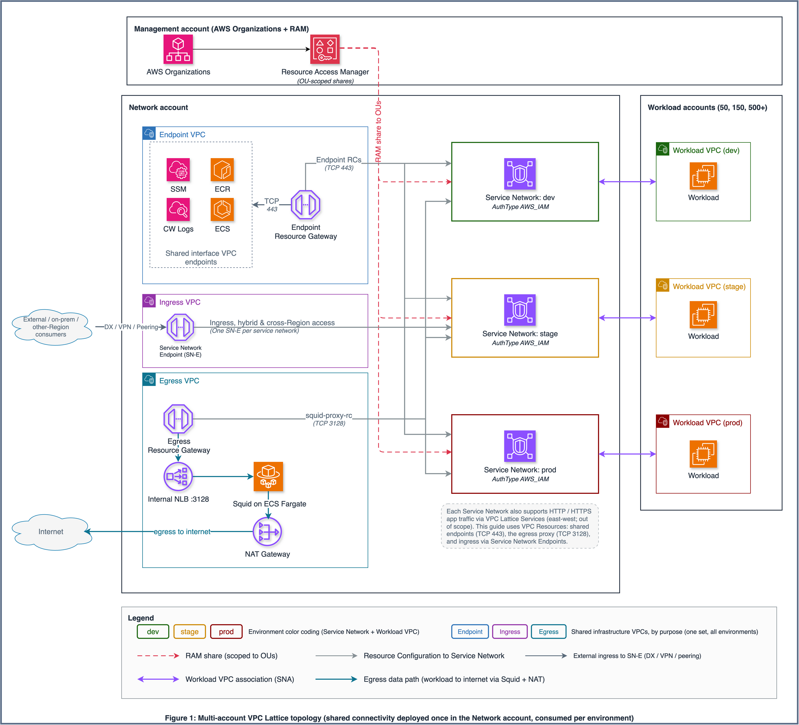
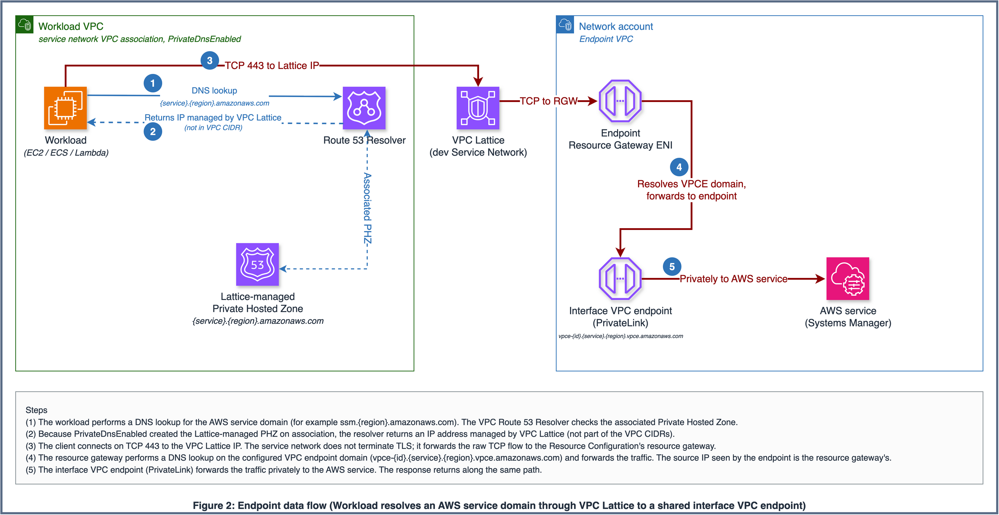
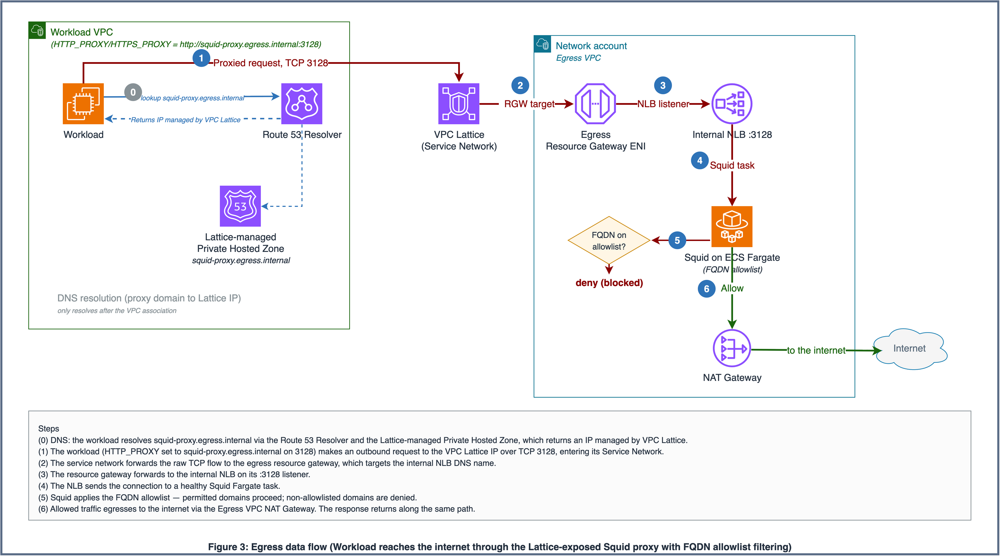
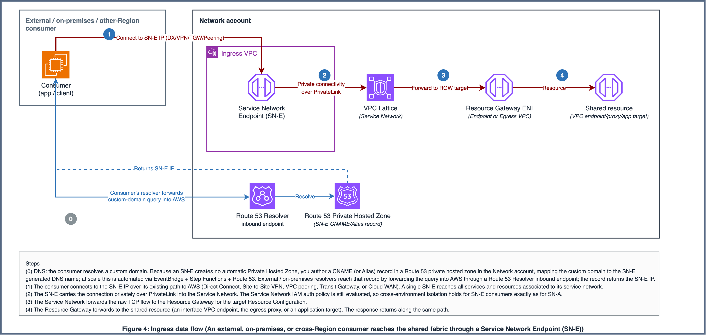

# Architecture Diagrams

This directory contains the architecture diagrams for the VPC Lattice multi-account connectivity guide. The diagrams illustrate the **VPC Lattice as the sole network fabric** pattern that the guide in `docs/` describes, the multi-account topology and the three core data-flow paths (endpoint access, centralized egress, and SN-E ingress).

The data-flow diagrams follow the style of the AWS Networking & Content Delivery blog post [*Streamline and secure access to shared services and resources with Amazon VPC Lattice*](https://aws.amazon.com/blogs/networking-and-content-delivery/streamline-and-secure-access-to-shared-services-and-resources-with-amazon-vpc-lattice/): an explicit DNS-resolution path (workload → Route 53 Resolver → Lattice-managed Private Hosted Zone → VPC Lattice IP) followed by the data path, with numbered steps and a step-by-step sidebar.

## Source Files

Each diagram is a **standalone single-page** `.drawio` file. (They were previously combined into one multi-page file, but single-page files export cleanly with the draw.io CLI, a multi-page file required `--page-index`, which on this CLI version exported the first page repeatedly.)

| Source file | Diagram | Referenced in |
|-------------|---------|---------------|
| `01-high-level-topology.drawio` | High-level multi-account topology | `docs/03-architecture.md` |
| `02-endpoint-data-flow.drawio` | Endpoint data flow (workload → AWS service) | `docs/03-architecture.md` |
| `03-egress-data-flow.drawio` | Egress data flow (workload → internet via Squid) | `docs/03-architecture.md`, `docs/06-phase3-centralized-egress.md` |
| `04-ingress-data-flow.drawio` | Ingress data flow (external/on-prem/cross-Region consumer → fabric via SN-E) | `docs/03-architecture.md`, `docs/08-phase5-ingress-service-network-endpoints.md` |

### Diagram descriptions

| Diagram | Description |
|---------|-------------|
| **High-level topology** | The Management account (AWS Organizations + RAM), the central Network account (Endpoint VPC with the endpoint Resource Gateway and shared interface endpoints; Egress VPC with the egress Resource Gateway, internal NLB, Squid on Fargate, and NAT Gateway; an Ingress VPC with a Service Network Endpoint; and the three dev/stage/prod Service Networks), and the Workload accounts associating their VPCs per environment. Shows OU-scoped RAM shares, Resource Configuration associations to all three Service Networks, per-environment VPC associations, and external/on-premises/cross-Region consumers reaching the Ingress VPC's SN-E over Direct Connect / VPN / peering. The three shared infrastructure VPCs use purpose colors (Endpoint = blue `#2E73B8`, Ingress = purple `#9333A8`, Egress = teal `#0E7490`); Service Networks and Workload VPCs use per-environment colors (dev green, stage amber, prod maroon). Includes a legend. East-west service-to-service via VPC Lattice Services remains out of scope and is noted only in the figure's footnote. |
| **Endpoint data flow** | Numbered steps 1-5 with a sidebar: workload → Route 53 Resolver → Lattice-managed Private Hosted Zone (returns a VPC Lattice IP) → VPC Lattice / Service Network → Endpoint Resource Gateway ENI (resolves the VPCE regional DNS) → interface VPC endpoint (PrivateLink) → AWS service. The Endpoint VPC container uses the purpose color blue (`#2E73B8`). |
| **Egress data flow** | A DNS step (step 0) plus numbered steps 1-6 with a sidebar: workload (HTTP_PROXY) → Lattice / Service Network → egress Resource Gateway ENI → internal NLB :3128 → Squid on Fargate (FQDN allowlist decision: allow vs. deny) → NAT Gateway → internet. The Egress VPC container uses the purpose color teal (`#0E7490`). |
| **Ingress data flow** | A DNS step (step 0) plus numbered steps 1-4 with a sidebar: an external, on-premises, or cross-Region consumer resolves a custom domain (a CNAME/Alias to the SN-E generated DNS name, automated via EventBridge + Step Functions + Route 53) → connects to the SN-E IP over Direct Connect / VPN / peering → SN-E carries the request privately over PrivateLink into the Service Network (the IAM auth policy still applies) → Resource Gateway → shared resource (endpoint, proxy, or app target). The Ingress VPC container uses the purpose color purple (`#9333A8`). |

## Exported Images

The document sections embed these filenames:

| Filename | Source | Format |
|----------|--------|--------|
| `01-high-level-topology.png` / `.svg` | `01-high-level-topology.drawio` | PNG (2x) / SVG |
| `02-endpoint-data-flow.png` / `.svg` | `02-endpoint-data-flow.drawio` | PNG (2x) / SVG |
| `03-egress-data-flow.png` / `.svg` | `03-egress-data-flow.drawio` | PNG (2x) / SVG |
| `04-ingress-data-flow.png` / `.svg` | `04-ingress-data-flow.drawio` | PNG (2x) / SVG |

## Export Instructions

### Option A: draw.io CLI (`drawio` command)

Requires the draw.io desktop app installed. On macOS: `brew install --cask drawio`. Because each diagram is its own single-page file, no `--page-index` flag is needed.

```bash
# PNG (high-resolution, 2x scale)
drawio --export --format png --scale 2 --output diagrams/01-high-level-topology.png diagrams/01-high-level-topology.drawio
drawio --export --format png --scale 2 --output diagrams/02-endpoint-data-flow.png  diagrams/02-endpoint-data-flow.drawio
drawio --export --format png --scale 2 --output diagrams/03-egress-data-flow.png    diagrams/03-egress-data-flow.drawio
drawio --export --format png --scale 2 --output diagrams/04-ingress-data-flow.png   diagrams/04-ingress-data-flow.drawio

# SVG (scalable)
drawio --export --format svg --output diagrams/01-high-level-topology.svg diagrams/01-high-level-topology.drawio
drawio --export --format svg --output diagrams/02-endpoint-data-flow.svg  diagrams/02-endpoint-data-flow.drawio
drawio --export --format svg --output diagrams/03-egress-data-flow.svg    diagrams/03-egress-data-flow.drawio
drawio --export --format svg --output diagrams/04-ingress-data-flow.svg   diagrams/04-ingress-data-flow.drawio
```

### Option B: draw.io Desktop App

1. Open each `.drawio` file in draw.io desktop.
2. **File → Export As → PNG** (set scale to 2x), then **File → Export As → SVG**, saving with the filenames above.

### Option C: draw.io Online (app.diagrams.net)

1. Open https://app.diagrams.net and import each `.drawio` file.
2. Use **File → Export As** to save PNG/SVG with the filenames above.

## Embedding in Documents

```markdown




```

## Design Notes

- All diagrams use official AWS Architecture Icons (`mxgraph.aws4.*` shapes) with labels below each icon.
- Container styling follows AWS reference-architecture conventions: solid black account boxes, `VPC` group containers, and rounded environment boxes for the Service Networks.
- **Two complementary color systems:**
  - **Purpose colors** for the three shared infrastructure VPC containers (one set, all environments): **Endpoint = blue (#2E73B8)**, **Ingress = purple (#9333A8)**, **Egress = teal (#0E7490)**.
  - **Environment colors** for the Service Networks and the per-environment Workload VPCs: **dev = green (#1B660F)**, **stage = amber (#CC8800)**, **prod = maroon (#8B0000)**.
  - A legend on the topology diagram explains both systems and the line styles.
- Flow steps are shown as solid blue numbered circles placed on or beside the relevant arrows, with a step-by-step sidebar on the data-flow diagrams. The DNS-only precursor step on the egress and ingress diagrams uses a grey circle (step 0).
- Arrow color coding, topology: red dashed (#DD344C) = RAM share, grey (#879196) = Resource Configuration to Service Network association, two-headed purple (#8C4FFF) = Workload VPC association (SN-A), teal (#0E7490) = egress data path, grey (#5A6B7B) = external ingress to the SN-E.
- Arrow color coding, data-flow diagrams: blue (#2E73B8) = DNS resolution path, maroon (#8B0000) = data/request path, teal (#0E7490) = egress (allowed) path, green (#1B660F) = egress to internet.
- Labels are sized to be readable at standard document width without zooming; on-arrow labels use a white background (`labelBackgroundColor=#FFFFFF`) so they sit cleanly on the line.
