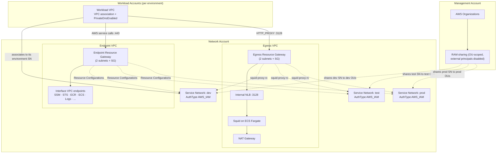
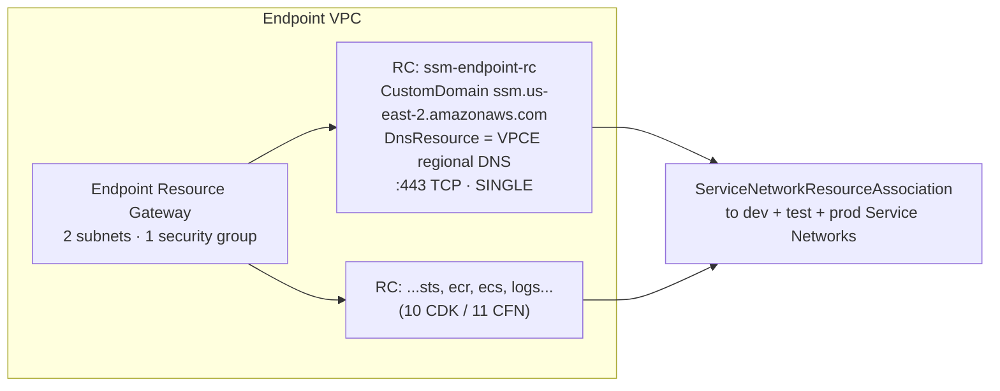
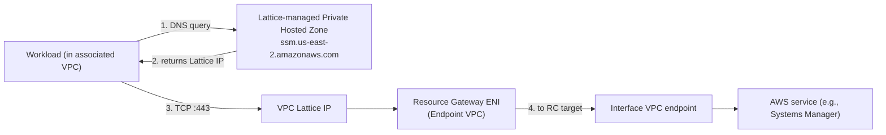
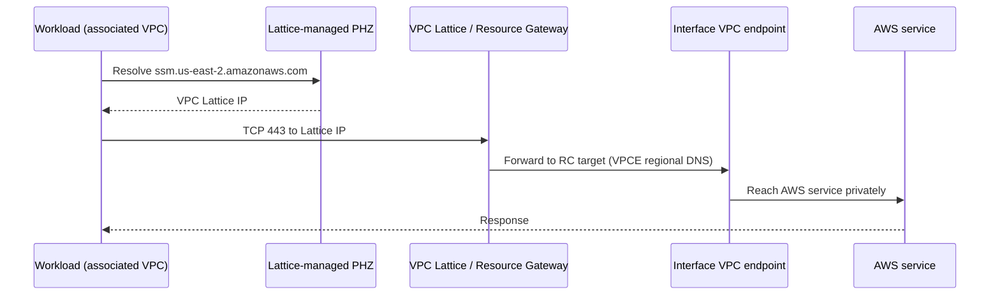
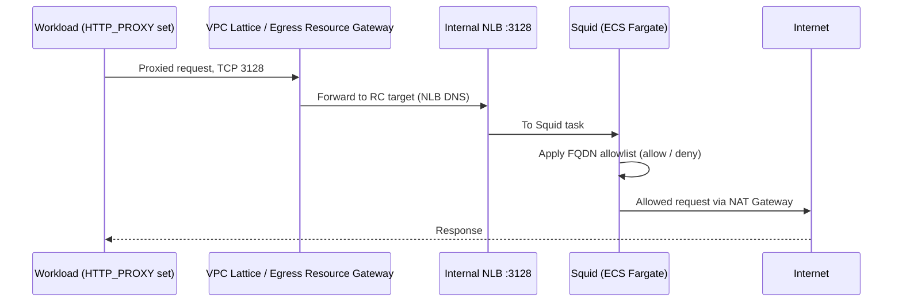
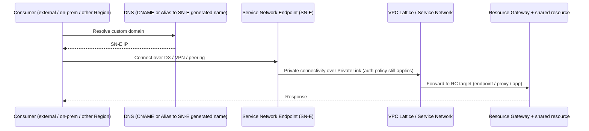

# Architecture

The [Prerequisites](02-prerequisites.md) section confirmed the organization-level, account-level, and tooling foundations the pattern depends on. This section explains how those pieces fit together: the multi-account topology, the three-environment isolation model, the VPC Lattice building blocks (Resource Gateways and Resource Configurations), and the automatic DNS behavior that makes onboarding a single action. The five implementation phases that follow translate this architecture into deployable Infrastructure as Code (IaC); here the goal is a clear mental model before you deploy anything.

> **A note on conventions.** As in the rest of this guide, all examples use the `us-east-2` Region and placeholder identifiers (organization ID `o-EXAMPLE12345`, account `111111111111`). The reference implementation deploys **three Service Networks**, one each for dev, test, and prod, named `sn-{env}-shared` (for example `sn-dev-shared`) in both the AWS Cloud Development Kit (CDK) and AWS CloudFormation paths. Throughout this section we refer to them generically, for example, "the dev service network."

## Connectivity patterns landscape: what this guide builds and defers

VPC Lattice supports several connectivity modalities on top of the same fabric. Before the topology, it helps to see the whole landscape and be explicit about which parts this guide actually deploys, so the diagrams that follow are read at the right scope. The high-level topology (Figure 1, below) shows the three **in-scope** patterns as the core architecture, and the one pattern that shares the same fabric but is **not** built by this guide.

| # | Pattern | Scope in this guide | Where |
|---|---------|---------------------|-------|
| 1 | **Shared AWS service access**, a workload VPC reaches the shared interface VPC endpoints through its environment's Service Network | **In scope** | [Phase 2](05-phase2-shared-endpoints.md), [Phase 4](07-phase4-workload-onboarding.md) |
| 2 | **Centralized internet egress**, a workload reaches the internet through the Lattice-exposed Squid proxy with FQDN filtering | **In scope** | [Phase 3](06-phase3-centralized-egress.md) |
| 3 | **Ingress, hybrid, and cross-Region**, consumers outside the associated VPC reach the fabric through a Service Network Endpoint (SN-E) | **In scope** | [Phase 5](08-phase5-ingress-service-network-endpoints.md) |
| 4 | **East-west service-to-service**, application-to-application connectivity using VPC Lattice **Services** (not VPC Resources) | **Out of scope** | [What this guide does not cover](00-introduction.md#what-this-guide-does-not-cover); [Next Steps](14-next-steps.md) |

The three **in-scope** patterns are what the five phases deploy, and they are the subject of the topology and data-flow diagrams below. The remaining pattern shares the *same* Service Networks but is deliberately kept out of scope: east-west service-to-service is a different VPC Lattice construct (Services rather than VPC Resources) with a different pricing and operational model. Patterns 1 and 2 use a **Service Network VPC Association (SN-A)** to connect each workload VPC; pattern 3 uses a **Service Network VPC Endpoint (SN-E)** so consumers beyond the associated VPC, on-premises, in another Region, or fronting an ingress layer, reach the same shared resources. Keeping the core scoped to these three VPC-Resource patterns is what lets the IaC, the diagrams, and the prose stay in lockstep, every component in the main body of Figure 1 maps to something the templates actually create.

## High-level multi-account topology

The pattern concentrates all shared connectivity in one central Network account and exposes it to every workload account through VPC Lattice. Three account roles participate:

- **Management (AWS Organizations) account.** Hosts AWS Organizations and AWS Resource Access Manager (RAM). It does not carry workload traffic. Its role in this architecture is governance: it defines the organizational units (OUs) that represent each environment and enables the RAM sharing that scopes connectivity to those OUs.
- **Network account.** The single home for shared connectivity. It contains two VPCs and the three Service Networks:
  - An **Endpoint VPC** that holds the pre-deployed interface VPC endpoints (Systems Manager, STS, Amazon ECR, Amazon ECS, CloudWatch Logs, and others) and a Resource Gateway that exposes them.
  - An **Egress VPC** that holds the centralized Squid forward proxy on Amazon ECS Fargate behind an internal Network Load Balancer (NLB), a NAT Gateway path to the internet, and a second Resource Gateway that exposes the proxy.
  - Three **Service Networks** (dev, test, prod), each carrying its own IAM auth policy. The Resource Configurations that front the endpoints and the egress proxy are associated to all three Service Networks, so the same shared connectivity is reachable from every environment, subject to that environment's auth policy and RAM share.
- **Workload accounts (50, 150, 500, or more).** Each contains one or more workload VPCs. A workload account consumes shared connectivity by associating its VPC to the Service Network for its environment. That single association, with private DNS enabled, is the entire onboarding action.

RAM ties the model together. Each Service Network is shared by RAM **only to the OUs that represent its environment**, with external principals disabled. A workload account in a dev OU receives (and auto-accepts) the share for the dev service network and associates its VPC to that network; it never sees the test or prod networks. Because sharing is scoped to OUs rather than to the whole Organization, the environment boundary is enforced at the share layer as well as in the IAM auth policy.

The following diagram shows the topology. The high-resolution renders are exported from the editable draw.io source and embedded in the guide; the inline Mermaid diagram below keeps this section self-contained.

*The topology diagram is maintained in the draw.io source at [`../diagrams/01-high-level-topology.drawio`](../diagrams/01-high-level-topology.drawio) and exported to `../diagrams/01-high-level-topology.png` (and an SVG of the same name) using AWS Architecture Icons, per-environment color coding, and a legend.*

## The three-service-network model and environment isolation

Environment isolation is the central security property of this pattern, and it is enforced by **defense in depth across two independent boundaries**: the IAM auth policy on each Service Network, and the RAM share that distributes it. (This satisfies requirement 6.3.)

Each environment gets its own Service Network created with `AuthType: AWS_IAM`. An IAM auth policy attached to the network allows the VPC Lattice invoke action only when the calling principal satisfies two conditions:

- `aws:PrincipalOrgID` equals the organization ID (the principal must belong to this Organization at all), and
- `aws:PrincipalOrgPaths` matches one of the OU paths for that environment (using a `ForAnyValue:StringLike` condition against the environment's OU paths, such as `o-EXAMPLE12345/r-.../ou-.../*`).

The practical effect: a principal in a dev OU can invoke through the dev service network but is denied by the prod network's auth policy, because its org path does not match any prod OU path. Isolation is expressed in identity terms, *which OU the caller lives in*, rather than in IP or routing terms.

The second boundary is the RAM share. Each Service Network is shared only to its environment's OUs, and the share sets `AllowExternalPrincipals: false`. A workload account outside an environment's OUs never receives the share, so it cannot even discover (let alone associate to) a Service Network for another environment. The two boundaries are complementary: even if a share were misconfigured, the auth policy still denies cross-environment access; even if an auth policy were loosened, the share boundary still prevents the association.

| Isolation layer | Mechanism | What it prevents |
|-----------------|-----------|------------------|
| Service Network auth policy | `AuthType: AWS_IAM` + condition keys `aws:PrincipalOrgID` and `aws:PrincipalOrgPaths` | A principal in one environment's OU invoking through another environment's network |
| RAM share scope | Share targets only the environment's OU ARNs; `AllowExternalPrincipals: false` | A workload account outside the environment discovering or associating to the network; sharing outside the Organization |

The reference implementation applies the same model to all three networks, with the dev, test, and prod auth policies differing only in the OU paths they permit. The detailed auth-policy and RAM configuration is covered in [Phase 1: Foundation](04-phase1-foundation.md); the security mapping to the Well-Architected Security pillar is covered in the security and Well-Architected sections.

## Resource Gateways and Resource Configurations

VPC Lattice exposes resources that live inside a VPC through two cooperating constructs. Understanding the difference between them is key to understanding the whole pattern.

### Resource Gateway

A **Resource Gateway** is a VPC Lattice component deployed *into* a VPC. It is the ingress point that lets Resource Configurations route traffic to resources inside that VPC. In this architecture there are two Resource Gateways in the Network account:

- An **endpoint Resource Gateway** in the Endpoint VPC (named, for example, `endpoint-resource-gateway` in CDK and `endpoint-resource-gw` in CloudFormation). It fronts the shared interface VPC endpoints.
- An **egress Resource Gateway** in the Egress VPC (named `egress-resource-gateway`). It fronts the internal NLB that sits in front of the Squid proxy.

Each Resource Gateway is deployed across **two subnets** (one per Availability Zone, for high availability) and is assigned an explicit **security group**. It provisions elastic network interfaces (ENIs) in those subnets, which is why the prerequisites call for Resource Gateway subnets of at least /24, the gateway scales ENIs with connection volume and must not contend for addresses.

### Resource Configuration

A **Resource Configuration** (RC) is a mapping that exposes a *single, specific resource* through a Resource Gateway to the Service Networks it is associated with. Each RC in this pattern uses:

- **`ResourceConfigurationType: SINGLE`**, one resource per configuration.
- **`CustomDomainName`**, the workload-facing domain that callers use, for example `ssm.us-east-2.amazonaws.com`. This is the name that VPC Lattice will resolve for associated workload VPCs.
- **A `DnsResource` definition**, the *actual target* DNS name behind the gateway, with `IpAddressType: IPV4`. For an endpoint RC, this target is the endpoint's regional VPCE DNS name; for the egress RC, it is the internal NLB DNS name.
- **`PortRanges`**, `443` for the AWS service endpoints, `3128` for the egress proxy.
- **`Protocol: TCP`**.

A critical implementation detail: the target VPCE DNS names are **not hardcoded**. The two IaC paths discover them differently but arrive at the same result, the deployment is self-healing, so if an endpoint is replaced and its DNS name changes, redeploying rediscovers the correct target:

- **CDK path** reads each interface endpoint's regional DNS name natively from `vpce.attrDnsEntries` at synthesis time (splitting the `hostedZoneId:dnsName` value), so there is **no Lambda** in the CDK path.
- **CloudFormation path** uses an inline Python 3.12 Lambda custom resource that calls `ec2:DescribeVpcEndpoints` at deploy time, because YAML cannot split the `attrDnsEntries` value natively.

Every RC is associated to **all three Service Networks** through a `ServiceNetworkResourceAssociation`, so dev, test, and prod workloads all reach the same shared endpoints and the same egress proxy. The reference implementation exposes **10 endpoint Resource Configurations in the CDK path** (SSM, SSM Messages, EC2 Messages, STS, ECR API, ECR DKR, CloudWatch Logs, ECS, ECS Agent, ECS Telemetry) and an **11th in the CloudFormation path** (`execute-api`), along with the single egress proxy RC.

The relationship between the constructs is hierarchical:

| RC attribute | Endpoint RCs | Egress proxy RC |
|--------------|--------------|-----------------|
| `ResourceConfigurationType` | `SINGLE` | `SINGLE` |
| `CustomDomainName` | e.g. `ssm.us-east-2.amazonaws.com` | proxy-facing domain |
| `DnsResource` target | VPCE regional DNS (discovered by Lambda) | internal NLB DNS name |
| `PortRanges` | `443` | `3128` |
| `Protocol` | `TCP` | `TCP` |
| Associated to | dev + test + prod Service Networks | dev + test + prod Service Networks |

## PrivateDnsEnabled behavior and automatic Private Hosted Zone creation

The feature that reduces onboarding to a single action is **`PrivateDnsEnabled`** on the VPC association. (This addresses requirements 8.1, 8.2, and 8.3.)

When a workload VPC associates to a Service Network with `PrivateDnsEnabled=true`, VPC Lattice automatically creates **Private Hosted Zones (PHZs)** for each associated Resource Configuration's custom domain. Concretely, after the dev workload VPC associates to the dev service network, that VPC can resolve `ssm.us-east-2.amazonaws.com`, `sts.us-east-2.amazonaws.com`, `ecr` domains, and the rest, each to VPC Lattice IP addresses, with **no per-workload DNS configuration, no Route 53 zones to author, and no endpoint to create in the workload account**. (Requirement 8.1, 8.2.)

The resolution path is fully managed end to end (requirement 8.3):

1. A workload in the associated VPC resolves an AWS service domain, for example `ssm.us-east-2.amazonaws.com`.
2. The Lattice-managed **Private Hosted Zone** for that custom domain (created automatically by the association) answers with a **VPC Lattice IP address**.
3. The workload connects to that Lattice IP, which routes through the **Resource Gateway ENI** in the Endpoint VPC.
4. The Resource Gateway forwards to the RC's target, the **interface VPC endpoint** (for AWS service access) or the **internal NLB and Squid proxy** (for egress).

Two configuration details from the IaC are worth noting, because they are where this behavior is switched on:

- In the CloudFormation core template, each `ServiceNetworkResourceAssociation` sets **`PrivateDnsEnabled: true`** at the association level; this is what causes Lattice to manage the PHZ for that RC's custom domain.
- The workload VPC association template sets **`PrivateDnsEnabled: true`** together with **`DnsOptions: PrivateDnsPreference: ALL_DOMAINS`**, instructing Lattice to manage resolution for all the associated custom domains in that workload VPC.

If a workload VPC already has its own Route 53 Private Hosted Zone for one of these domains, resolution precedence and the steps to avoid a conflict are covered in [Troubleshooting and FAQ](12-troubleshooting-faq.md).

## Two ways a VPC reaches a Service Network: association (SN-A) vs endpoint (SN-E)

Everything above describes the **Service Network VPC Association (SN-A)**, the model this guide's first four phases use for in-Region workloads. It is the right default for the large majority of in-Region, multi-account workloads, and it is what gives you the single-action onboarding with automatic DNS. But it is not the only way to connect a VPC to a Service Network, and the alternative, built in [Phase 5](08-phase5-ingress-service-network-endpoints.md), matters for ingress, hybrid, cross-Region, and split-function VPCs.

VPC Lattice offers two connection methods:

| | **SN-A, Service Network VPC Association** | **SN-E, Service Network VPC Endpoint** |
|---|---|---|
| What this guide uses | Phases 2-4 (the default for in-Region workloads) | [Phase 5: Ingress via Service Network Endpoints](08-phase5-ingress-service-network-endpoints.md) |
| Associations per VPC | **One** SN-A per VPC | **Multiple** SN-Es per VPC (one per service network) |
| Reachable from | The directly associated VPC only | The endpoint's VPC **and** beyond it, peered VPCs, AWS Transit Gateway, AWS Cloud WAN, on-premises over Direct Connect / Site-to-Site VPN, and other AWS Regions |
| DNS behavior | `PrivateDnsEnabled` → Lattice **auto-creates** the PHZs; nothing to author | The endpoint exposes a **per-endpoint generated DNS name**; you create your own record (typically a **CNAME**, or an **Alias**) to give consumers a friendly name |
| IP addressing | Resolves to Lattice-managed IPs (resources: `129.224.0.0/17`) | Endpoint consumes secondary IPs from a `/28` (IPv4) / `/80` (IPv6) per AZ; each VPC resource gets its **own** secondary IP, services may share one |
| Best for | In-Region workload accounts consuming shared services/resources | Hybrid access, cross-Region consumers, ingress proxy layers, and VPCs that must reach **more than one** service network |

The decisive constraint is usually the **one-SN-A-per-VPC limit**. A workload VPC that must consume two different service networks (for example a shared-services network and a partner network), or that must be reachable from on-premises or another Region, cannot express that with associations alone: that is the SN-E use case.

The reason SN-E needs an explicit DNS record (and SN-A does not) follows directly from the table: with SN-A, `PrivateDnsEnabled` lets Lattice own the PHZ and answer for the custom domains automatically. With SN-E, the endpoint publishes a **generated** regional DNS name per associated service/resource (visible on the endpoint's Associations tab, or via `aws ec2 describe-vpc-endpoint-associations`), and you map your custom domain to that generated name yourself. A **CNAME** is the straightforward choice for any non-apex name; an **Alias** record is required if you need the custom name at a zone apex. Because that generated name is not known until the endpoint exists, this record creation is the natural thing to **automate**, which is exactly what [Phase 5: Ingress via Service Network Endpoints](08-phase5-ingress-service-network-endpoints.md) covers, using an EventBridge + Step Functions + Route 53 pattern.

> **Prescriptive default.** Use **SN-A** as the principal access method for both VPC Lattice services and VPC resources in this multi-account pattern; it is simpler, needs no DNS authoring, and maps one VPC to its intended environment cleanly. Reach for **SN-E** for the specific multi-dimensional cases above (hybrid, cross-Region, ingress proxy, or multi-network VPCs). This mirrors the guidance in the AWS post [Managing DNS resolution with Amazon VPC Lattice and VPC resources](https://aws.amazon.com/blogs/networking-and-content-delivery/managing-dns-resolution-with-amazon-vpc-lattice-and-vpc-resources/).

## Data-flow paths

The topology above shows *what* is connected; the data-flow diagrams show *how* a request travels. All three are maintained in the draw.io source and detailed in their respective phase sections, the endpoint path in [Phase 2: Shared Endpoints](05-phase2-shared-endpoints.md), the egress path in [Phase 3: Centralized Egress](06-phase3-centralized-egress.md), and the ingress path in [Phase 5: Ingress via Service Network Endpoints](08-phase5-ingress-service-network-endpoints.md). Brief inline summaries follow.

### Endpoint data flow (workload to AWS service)

*Maintained in [`../diagrams/02-endpoint-data-flow.drawio`](../diagrams/02-endpoint-data-flow.drawio); exported to `../diagrams/02-endpoint-data-flow.png` (and SVG).*

### Egress data flow (workload to internet through the proxy)

*Maintained in [`../diagrams/03-egress-data-flow.drawio`](../diagrams/03-egress-data-flow.drawio); exported to `../diagrams/03-egress-data-flow.png` (and SVG).*

### Ingress data flow (external/on-premises/cross-Region consumer to the fabric)

*Maintained in [`../diagrams/04-ingress-data-flow.drawio`](../diagrams/04-ingress-data-flow.drawio); exported to `../diagrams/04-ingress-data-flow.png` (and SVG).*

## How this architecture maps to the phases

The remaining implementation work follows the dependency order implied by this architecture:

1. **[Phase 1: Foundation](04-phase1-foundation.md)**, create the three Service Networks, attach the OU-scoped IAM auth policies, and configure the RAM shares. Everything else associates to these networks, so they come first.
2. **[Phase 2: Shared Endpoints](05-phase2-shared-endpoints.md)**, deploy the endpoint Resource Gateway and the endpoint Resource Configurations (the CDK path reads each VPCE's regional DNS natively from `attrDnsEntries`; the CloudFormation path discovers it with an inline Lambda).
3. **[Phase 3: Centralized Egress](06-phase3-centralized-egress.md)**, deploy the Squid proxy, the internal NLB, the egress Resource Gateway, and the egress Resource Configuration.
4. **[Phase 4: Workload Onboarding](07-phase4-workload-onboarding.md)**, associate each workload VPC with `PrivateDnsEnabled`, and automate that association across many accounts.
5. **[Phase 5: Ingress via Service Network Endpoints](08-phase5-ingress-service-network-endpoints.md)**, expose the same shared fabric to external, on-premises, and cross-Region consumers through SN-E, with EventBridge + Step Functions + Route 53 DNS automation keeping the custom-domain records current.

With the topology, the isolation model, the Resource Gateway and Resource Configuration constructs, and the automatic DNS behavior in mind, you are ready to build the foundation.

Continue to [Phase 1: Foundation](04-phase1-foundation.md).
