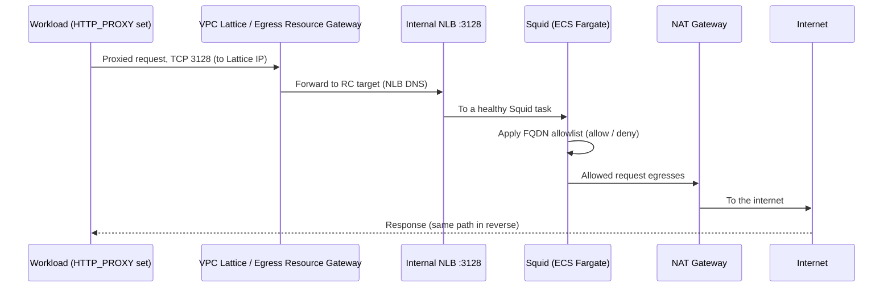

# Phase 3: Centralized Egress

[Phase 2: Shared Endpoints](05-phase2-shared-endpoints.md) gave every workload account private access to AWS service endpoints through VPC Lattice. This phase adds the other half of outbound connectivity: **filtered access to the public internet**, centralized in one place. It deploys a **Squid forward proxy on Amazon ECS Fargate** behind an **internal Network Load Balancer (NLB)** in the Network account's Egress VPC, then exposes that NLB to all three Service Networks through a VPC Lattice Resource Configuration, exactly the same exposure mechanism Phase 2 used for the endpoints.

The result is a single, auditable egress chokepoint. No workload account runs its own NAT Gateway, and no workload reaches the internet except through a proxy that enforces a **fully qualified domain name (FQDN) allowlist**. This is the pattern's answer to data-exfiltration control: outbound traffic is allowed only to domains you explicitly permit, and the proxy itself is reachable only over VPC Lattice, never from the internet.

> **A note on conventions.** As elsewhere in this guide, examples use the `us-east-2` Region and placeholder identifiers (organization ID `o-EXAMPLE12345`, account `111111111111`). The reference IaC names the egress Resource Gateway `egress-resource-gateway` and the egress Resource Configuration `squid-proxy-rc`; this section uses those names directly because they are fixed in the stack.

## Why Centralized Egress comes after Foundation

This phase depends on Phase 1 for one concrete reason, and it is the same reason Phase 2 did: **the egress Resource Configuration is associated to all three Service Networks, and that association needs the Service Network IDs as inputs.** Those IDs are produced by the Foundation phase and do not exist until it has run. (This satisfies the dependency rationale in requirements 4.4 and 4.2.)

In the CDK path the dependency is explicit and enforced by the framework:

- `VpcLatticeCoreStack` (Phase 1) exports `serviceNetworkIds` for dev, test, and prod.
- `SquidEgressStack` (this phase) consumes those IDs through its `serviceNetworkIds` prop and declares `egressStack.addDependency(coreStack)` in `cdk/bin/app.ts`, so CloudFormation will not deploy the egress stack until the core stack is complete.

Note what this phase does **not** depend on: **Phase 2.** Shared Endpoints and Centralized Egress are independent siblings, both attach to the Service Networks from Phase 1, but neither references the other. You can deploy them in either order, or in parallel, as long as Phase 1 is done first. This guide presents endpoints before egress only because most teams enable private AWS service access before they enable filtered internet access; the IaC imposes no ordering between the two.

## Account context

| Item | Value |
|------|-------|
| Deployment target | **Network account**, into the **Egress VPC** |
| Region | `us-east-2` (adjust if you deploy elsewhere) |
| Depends on | [Phase 1: Foundation](04-phase1-foundation.md), needs the three Service Network IDs |
| Independent of | [Phase 2: Shared Endpoints](05-phase2-shared-endpoints.md), no cross-reference either way |
| Resources created | 1 ECS cluster, 1 Fargate task definition + service, 1 internal NLB (+ listener + target group), 1 CloudWatch log group, 1 egress Resource Gateway, 1 Resource Configuration (`squid-proxy-rc`), one `ServiceNetworkResourceAssociation` per Service Network |
| Internet path | The Egress VPC's existing **NAT Gateway** (a prerequisite, not created here) |
| Consumed by | Phase 4 (workloads reach the proxy after their VPC association) |

Everything in this phase deploys to the Network account, specifically into the Egress VPC that already holds the NAT Gateway path to the internet. No deployment touches the management account or any workload account in this phase.

## Prerequisites

The global prerequisites in [Prerequisites](02-prerequisites.md) must be satisfied. The items below are the ones this phase depends on directly:

- [ ] **Phase 1 is complete**, and the three Service Network IDs are available as CDK stack outputs (`ServiceNetworkDevId`, `ServiceNetworkTestId`, `ServiceNetworkProdId`) and consumed by this stack via `coreStack.serviceNetworkIds`.
- [ ] **The Egress VPC, two Resource Gateway subnets, and the egress security group exist**, with their IDs published to the `/netfabric/network/...` SSM paths (or your equivalent if you re-pointed the IaC to a different prefix such as LZA's `/accelerator/network/...`). The stack resolves these at deploy time (`egressVpcSsmPath`, `egressSubnetASsmPath`, `egressSubnetBSsmPath`, `egressSgSsmPath`) rather than hardcoding them.
- [ ] **The Egress VPC has a NAT Gateway** (and a route to it from the private subnets where the Fargate tasks run). The proxy reaches the internet through this NAT Gateway; the stack does not create it.
- [ ] **Resource Gateway subnets are a minimum of /24.** The egress Resource Gateway provisions elastic network interfaces (ENIs) in these subnets and scales them with connection volume; undersized subnets risk IP exhaustion. (See [subnet sizing](02-prerequisites.md#3-subnet-sizing-requirements); this is requirement 9.3.)
- [ ] **The egress security group permits the Squid path**, ingress to the Fargate tasks on TCP 3128 from the NLB / Resource Gateway, and egress to the internet (443/80 as your allowlist requires) toward the NAT Gateway.
- [ ] **Deployment IAM capability in the Network account** to create ECS clusters, Fargate task definitions and services, an NLB, a CloudWatch log group, VPC Lattice Resource Gateways and Resource Configurations, and Service Network associations; and to read the `/netfabric/network/...` SSM parameters (or your equivalent SSM prefix). (CDK path additionally requires `cdk bootstrap`.)

## Step 1, Stand up the ECS Fargate Squid service

The proxy is an ECS Fargate service running the Squid container, in the imported Egress VPC. Three resources make up the compute layer: an **ECS cluster**, a **Fargate task definition**, and a **Fargate service**.

The cluster is named `squid-egress-cluster` with **Container Insights enabled**, attached to the imported Egress VPC (resolved from SSM, exactly as Phase 2 resolves its VPC):

```typescript
// cdk/lib/squid-egress-stack.ts
const cluster = new ecs.Cluster(this, 'SquidCluster', {
  vpc,
  clusterName: 'squid-egress-cluster',
  containerInsights: true,
});
```

The task definition uses the family `squid-egress-proxy` with **configurable CPU and memory** (defaulting to `512` CPU units and `1024` MiB, from the `squidCpu`/`squidMemory` context in `app.ts`). Its single, essential container runs the registry image `ubuntu/squid:latest`, maps **container port `3128/TCP`** (Squid's default proxy port), logs to CloudWatch via the `awslogs` driver, receives the FQDN allowlist as the `ALLOWED_DOMAINS` environment variable (see [Step 2](#step-2--manage-the-fqdn-allowlist-via-the-allowed_domains-environment-variable)), and enables **ECS Exec** through `LinuxParameters` `initProcessEnabled`:

```typescript
// cdk/lib/squid-egress-stack.ts
const logGroup = new logs.LogGroup(this, 'SquidLogs', {
  logGroupName: '/ecs/squid-egress-proxy',
  retention: logs.RetentionDays.ONE_MONTH,
  removalPolicy: cdk.RemovalPolicy.DESTROY,
});

const taskDef = new ecs.FargateTaskDefinition(this, 'SquidTaskDef', {
  cpu: props.cpu,             // default 512
  memoryLimitMiB: props.memory, // default 1024
  family: 'squid-egress-proxy',
});

taskDef.addContainer('squid', {
  image: ecs.ContainerImage.fromRegistry('ubuntu/squid:latest'),
  logging: ecs.LogDrivers.awsLogs({ logGroup, streamPrefix: 'squid' }),
  portMappings: [{ containerPort: 3128, protocol: ecs.Protocol.TCP }],
  environment: { ALLOWED_DOMAINS: props.allowedDomains },
  essential: true,
  // ECS Exec for live troubleshooting
  linuxParameters: new ecs.LinuxParameters(this, 'SquidLinuxParams', {
    initProcessEnabled: true,
  }),
});
```

The service runs `desiredCount` tasks (default `2`, for two-AZ availability) in the Egress VPC's **private subnets**, with **`assignPublicIp: false`** (the tasks have no public IP; their only route out is the NAT Gateway) and the egress security group resolved from SSM. **`enableExecuteCommand: true`** turns on ECS Exec so an operator can open a shell into a running task to inspect Squid:

```typescript
// cdk/lib/squid-egress-stack.ts
const service = new ecs.FargateService(this, 'SquidService', {
  cluster,
  taskDefinition: taskDef,
  desiredCount: props.desiredCount, // default 2
  assignPublicIp: false,
  securityGroups: [squidSg],
  vpcSubnets: { subnets: vpc.privateSubnets },
  enableExecuteCommand: true,
});
```

| Setting | Value | Source / default |
|---------|-------|------------------|
| Cluster name | `squid-egress-cluster` | fixed |
| Container Insights | enabled | fixed |
| Task family | `squid-egress-proxy` | fixed |
| Container image | `ubuntu/squid:latest` (registry) | fixed |
| Container port | `3128/TCP` | fixed |
| Log group | `/ecs/squid-egress-proxy`, retention 1 month, `DESTROY` on delete | fixed |
| ECS Exec | enabled (`enableExecuteCommand` + `initProcessEnabled`) | fixed |
| `desiredCount` | `2` | `squidDesiredCount` context |
| `cpu` | `512` | `squidCpu` context |
| `memory` | `1024` MiB | `squidMemory` context |
| `assignPublicIp` | `false` | fixed |
| Subnets | Egress VPC private subnets | from SSM |

> **Image note.** The reference points at the public `ubuntu/squid:latest` image to keep the example self-contained. For production, build a pinned Squid image with your own `squid.conf` (and the entrypoint that reads `ALLOWED_DOMAINS`) and push it to Amazon ECR, then reference that immutable tag instead of `:latest`. The shared ECR endpoint deployed in [Phase 2](05-phase2-shared-endpoints.md) is exactly what lets Fargate pull that image privately.

## Step 2, Manage the FQDN allowlist via the ALLOWED_DOMAINS environment variable

The proxy's filtering policy is a list of permitted FQDNs, passed into the container as the **`ALLOWED_DOMAINS`** environment variable. Its value comes from `props.allowedDomains`, which is wired from the **`squidAllowedDomains`** CDK context key in `app.ts`. Squid reads this allowlist and **denies any request to a domain not on it**; this is the FQDN allowlist that enforces requirement 13.3.

Because it is a plain environment variable on the task definition, **updating the allowlist means updating the task definition and redeploying the service**, `npx cdk deploy SquidEgressStack` with a new `squidAllowedDomains` value rolls out a new task revision, and ECS replaces the running tasks. There is no separate control plane for the list; the task definition *is* the source of truth.

### Why a plain environment variable (and the cdk-nag suppression)

`cdk-nag` flags environment variables on task definitions (`AwsSolutions-ECS2`) because secrets do not belong in plaintext env vars. This stack carries a documented suppression for that rule, and the rationale is deliberate: **`ALLOWED_DOMAINS` is non-sensitive configuration, a public FQDN allowlist, not a credential.** It contains no secrets, keys, or tokens, so the usual remedy (AWS Secrets Manager or an SSM `SecureString`) would add cost and indirection for no security gain.

```typescript
// cdk/lib/squid-egress-stack.ts, suppression rationale
NagSuppressions.addResourceSuppressionsByPath(this,
  `/${this.stackName}/SquidTaskDef/Resource`,
  [{
    id: 'AwsSolutions-ECS2',
    reason: 'ALLOWED_DOMAINS is a non-sensitive configuration value containing a public FQDN allowlist. It does not contain secrets or credentials.',
  }],
);
```

If your allowlist grows long or you want to change it without a stack deploy, you can source it differently without changing the architecture: store the list in an **SSM Parameter Store parameter** (or a small config file pulled at task start) and have the container read it at startup. That trades the simplicity of a single env var for the ability to update the list out of band. For most teams the env var is the right default; reach for Parameter Store when the list is large or changes often.

## Step 3, Expose the NLB to the Service Networks (Resource Gateway + Resource Configuration)

This is the same VPC Lattice exposure pattern as Phase 2, a Resource Gateway in the VPC, a Resource Configuration that targets a DNS name behind it, and a `ServiceNetworkResourceAssociation` to each Service Network, applied here to the egress proxy instead of an endpoint.

First, the workloads' traffic terminates at an **internal NLB** in the Egress VPC. The NLB is `internetFacing: false` (reachable only from inside the VPC, by the Resource Gateway) with `crossZoneEnabled: true`, a **TCP:3128 listener**, and a target group that forwards to the Fargate service with a **TCP health check on port 3128 every 30 seconds**:

```typescript
// cdk/lib/squid-egress-stack.ts
const nlb = new elbv2.NetworkLoadBalancer(this, 'SquidNlb', {
  vpc,
  internetFacing: false,
  crossZoneEnabled: true,
  vpcSubnets: { subnets: vpc.privateSubnets },
});

const listener = nlb.addListener('SquidListener', {
  port: 3128,
  protocol: elbv2.Protocol.TCP,
});

listener.addTargets('SquidTargets', {
  port: 3128,
  protocol: elbv2.Protocol.TCP,
  targets: [service],
  healthCheck: {
    enabled: true,
    port: '3128',
    protocol: elbv2.Protocol.TCP,
    interval: cdk.Duration.seconds(30),
  },
});
```

Next, the **egress Resource Gateway** (`egress-resource-gateway`) is deployed across the two egress subnets with the egress security group, the ingress point that lets the Resource Configuration route Lattice traffic into the Egress VPC:

```typescript
// cdk/lib/squid-egress-stack.ts
const resourceGateway = new cdk.CfnResource(this, 'EgressResourceGateway', {
  type: 'AWS::VpcLattice::ResourceGateway',
  properties: {
    Name: 'egress-resource-gateway',
    VpcIdentifier: egressVpcId,
    SubnetIds: [subnetAId, subnetBId],
    SecurityGroupIds: [sgId],
  },
});
```

Finally, the **Resource Configuration** `squid-proxy-rc` maps a single resource, the internal NLB, through that gateway. Its `DnsResource.DomainName` is the NLB's DNS name (`nlb.loadBalancerDnsName`), with `PortRanges: ['3128']` and `Protocol: TCP`. It is then associated to **all three Service Networks** so dev, test, and prod workloads all reach the same proxy:

```typescript
// cdk/lib/squid-egress-stack.ts
const squidRc = new cdk.CfnResource(this, 'SquidProxyRC', {
  type: 'AWS::VpcLattice::ResourceConfiguration',
  properties: {
    Name: 'squid-proxy-rc',
    ResourceGatewayIdentifier: resourceGateway.getAtt('Id'),
    ResourceConfigurationDefinition: {
      DnsResource: {
        DomainName: nlb.loadBalancerDnsName, // the internal NLB DNS name
        IpAddressType: 'IPV4',
      },
    },
    PortRanges: ['3128'],
    Protocol: 'TCP',
  },
});

// Associate squid-proxy-rc with dev + test + prod Service Networks
for (const [envName, snId] of Object.entries(props.serviceNetworkIds)) {
  new cdk.CfnResource(this, `SquidRCAssoc-${envName}`, {
    type: 'AWS::VpcLattice::ServiceNetworkResourceAssociation',
    properties: {
      ServiceNetworkIdentifier: snId,
      ResourceConfigurationIdentifier: squidRc.getAtt('Id'),
    },
  });
}
```

| RC attribute | Value |
|--------------|-------|
| `Name` | `squid-proxy-rc` |
| `DnsResource.DomainName` (target) | internal NLB DNS name (`nlb.loadBalancerDnsName`) |
| `IpAddressType` | `IPV4` |
| `PortRanges` | `['3128']` |
| `Protocol` | `TCP` |
| Associated to | dev + test + prod Service Networks |

> **Why this is secure by construction.** The NLB is internal (`internetFacing: false`), and the only way into it is the egress Resource Gateway, which is in turn reachable only from VPC Lattice. A workload cannot reach the proxy unless its VPC is associated to a Service Network that the RC is associated to, which is gated by the OU-scoped auth policy and RAM share from Phase 1. The proxy has no public surface at all. This is the egress counterpart to the same Lattice exposure model used for the endpoints.

The stack also carries a documented `cdk-nag` suppression for the NLB itself (`AwsSolutions-ELB2`, access logging): because this is an internal-only NLB reachable solely via the Resource Gateway, observability is provided by **VPC Lattice access logs at the Service Network level** rather than by NLB access logs (which would require an S3 bucket and add cost for an internal load balancer).

## Step 4, Configure workloads to use the proxy (HTTP_PROXY / HTTPS_PROXY)

Once a workload VPC is associated to its Service Network (that is Phase 4's job), the Resource Configuration's custom domain `squid-proxy.egress.internal` resolves inside that VPC through the Lattice-managed Private Hosted Zone, the same way the endpoint domains do. Workloads then route outbound HTTP and HTTPS through the proxy by setting the standard proxy environment variables to the Lattice-exposed proxy domain on port `3128` (requirement 13.2):

```bash
# On the workload host/container
export HTTP_PROXY=http://squid-proxy.egress.internal:3128
export HTTPS_PROXY=http://squid-proxy.egress.internal:3128

# Keep AWS service traffic OFF the proxy, it goes direct via the Phase 2 endpoints
export NO_PROXY=169.254.169.254,.amazonaws.com,.us-east-2.amazonaws.com
```

Two points matter here:

- **`NO_PROXY` should exclude the AWS service domains** that Phase 2 exposes as endpoints (for example `*.amazonaws.com` and the instance metadata address `169.254.169.254`). Those calls should travel the direct Lattice-to-endpoint path, not be tunneled through the egress proxy. Only genuine internet-bound traffic should hit `HTTP_PROXY`/`HTTPS_PROXY`.
- **The proxy domain is reachable only after the workload VPC association** in [Phase 4](07-phase4-workload-onboarding.md). Until then, `squid-proxy.egress.internal` does not resolve in the workload VPC, which is the intended behavior, not a failure.

Most language runtimes, package managers, and the AWS CLI honor `HTTP_PROXY`/`HTTPS_PROXY`/`NO_PROXY` automatically, so for many workloads this is a configuration change with no code change. Applications that manage their own HTTP clients may need to be pointed at the proxy explicitly.

## Choosing Squid: alternatives and rationale

Squid is the recommended default for this pattern, but it is not the only way to build a filtered egress chokepoint. The two main alternatives are **AWS Network Firewall** and **third-party proxy/firewall appliances**. (This addresses requirement 13.5.)

| Dimension | Squid on Fargate *(this pattern)* | AWS Network Firewall | Third-party proxy / NGFW |
|-----------|-----------------------------------|----------------------|--------------------------|
| Filtering model | FQDN allowlist (forward proxy) | Suricata-style rules, domain lists, deep packet inspection | Vendor-specific (URL/app-layer, IPS/IDS) |
| Management | You run the container; full control of `squid.conf` | Fully managed by AWS | Vendor console + your ops |
| Depth of inspection | HTTP/HTTPS proxy, FQDN-level | Deeper L3-L7 inspection, TLS inspection options | Often deepest (full NGFW feature sets) |
| Licensing cost | None (open source) | AWS usage-based (endpoint-hours + data) | Commercial license + usage |
| Operational burden | Patching, scaling, config ownership | Low (managed rules, AWS-native) | Vendor support, but added complexity |
| Best when | You want lightweight, well-understood FQDN filtering with no license cost | You need managed rules, deep packet inspection, or specific compliance controls | You have standardized on a vendor's NGFW feature set and support |

**Why Squid for this pattern.** The design selects Squid on ECS Fargate because it is **lightweight, well-understood, provides exactly the FQDN allowlist filtering this architecture needs, carries no license cost, and gives full control** over the proxy configuration. For the core goal here, a centralized, auditable egress point that permits traffic only to an explicit list of domains, Squid does the job without the cost or operational footprint of a managed firewall or a commercial appliance, and it slots cleanly behind an internal NLB as a standard Fargate service.

**When to choose Network Firewall instead.** Reach for AWS Network Firewall when you need **deep packet inspection, managed/Suricata rule sets, TLS inspection, or specific compliance controls** that go beyond FQDN allowlisting, and you prefer an AWS-managed service over running your own proxy. It costs more and inspects more; for many regulated environments that trade is worth it. Choose a third-party NGFW when your organization has already standardized on a vendor's feature set and support model. The Lattice exposure mechanism in this phase is unchanged regardless of what sits behind the NLB, only the proxy/firewall implementation differs.

## Traffic path

The end-to-end egress path is explicit (requirement 13.4):

**Workload VPC → Lattice Service Network → Egress Resource Gateway → NLB :3128 → Squid (FQDN allowlist) → NAT Gateway → Internet.**


*Maintained in the draw.io source at [`../diagrams/03-egress-data-flow.drawio`](../diagrams/03-egress-data-flow.drawio); exported to `../diagrams/03-egress-data-flow.png` (and an SVG of the same name).*

Step by step:

1. A workload (with `HTTP_PROXY`/`HTTPS_PROXY` set to `squid-proxy.egress.internal` on port 3128) makes an outbound request. It resolves the proxy domain through the Lattice-managed Private Hosted Zone to a **VPC Lattice IP**.
2. The proxied request enters its environment's **Service Network** over TCP 3128.
3. Lattice routes it to the RC target through the **egress Resource Gateway** ENI in the Egress VPC.
4. The gateway forwards to the **internal NLB** on its `:3128` listener.
5. The NLB sends the connection to a healthy **Squid** Fargate task.
6. **Squid applies the FQDN allowlist**, if the destination domain is permitted, the request proceeds; if not, Squid denies it.
7. Allowed traffic egresses to the **internet via the Egress VPC's NAT Gateway**, and the response returns along the same path.



## What centralized egress does not cover (and how to govern it)

Centralized egress is a **network-layer** control: it can only filter traffic that actually leaves through your VPCs. Compute that runs on AWS-managed network egresses on a path your route tables, security groups, and the Squid proxy never see. The canonical example is an **AWS Lambda function with no VPC configuration**: it runs inside a Lambda-service-managed VPC that is not visible to you, so it reaches the internet independently of this egress chokepoint. (A VPC Lattice *Service* can target such a function, which makes it easy to reuse a VPC-less "utility" function as an egress shortcut; note this is the Lattice Services model, distinct from the VPC Resources model used elsewhere in this guide. The governance answer is the same regardless of how the function is fronted.)

You cannot put network restrictions on a function that is not in your VPC, no security group or route applies to it. The control is therefore at the governance layer: **require that functions be attached to an approved VPC**, which brings them back under this egress design. Because the workload VPC here is isolated (no NAT, no internet gateway; the only egress is Lattice to Squid), a VPC-attached function in it has no internet path except the filtered proxy. Attachment is what makes the control real.

Recommended as defense in depth:

- **Preventive (SCP).** Deny `lambda:CreateFunction` and `lambda:UpdateFunctionConfiguration` unless the request specifies approved VPC settings, using the [Lambda VPC IAM condition keys](https://aws.amazon.com/blogs/compute/using-aws-lambda-iam-condition-keys-for-vpc-settings/) `lambda:VpcIds` / `lambda:SubnetIds` / `lambda:SecurityGroupIds`. With Landing Zone Accelerator, define the policy as an SCP in the LZA config and attach it to the workload OUs, so it is enforced consistently as new accounts join (see [LZA SCP deployment](https://docs.aws.amazon.com/solutions/latest/landing-zone-accelerator-on-aws/awsaccelerator-pipeline.html)).
- **Detective (AWS Config).** Add the managed rule [`lambda-inside-vpc`](https://docs.aws.amazon.com/config/latest/developerguide/lambda-inside-vpc.html) to flag (and optionally remediate) any function that is not VPC-enabled.
- **Paved road.** Ship a golden Lambda template that already sets VPC config and `HTTP(S)_PROXY` to the Squid endpoint, and provide interface VPC endpoints so most utility functions never need internet egress at all. The bypass is almost always a convenience choice, not a malicious one, so making the compliant path the easy path does most of the work; the cost consolidation and FQDN audit trail of centralized egress reinforce it.

Scope the VPC-attachment requirement deliberately (for example, to workload OUs with a vetted exception process), since attaching every function to a VPC consumes subnet IPs and adds operational surface.

## IaC reference

This phase corresponds to a single CDK stack. (This addresses requirement 4.3.)

### CDK path (authoritative)

The stack is `SquidEgressStack` in `cdk/lib/squid-egress-stack.ts`. Its props supply the four SSM paths, the Service Network IDs from the core stack, the allowlist, and the sizing knobs:

```typescript
// props consumed by SquidEgressStack
egressVpcSsmPath: string;        // SSM path to the Egress VPC ID
egressSubnetASsmPath: string;    // SSM path to Resource Gateway subnet A
egressSubnetBSsmPath: string;    // SSM path to Resource Gateway subnet B
egressSgSsmPath: string;         // SSM path to the egress security group
serviceNetworkIds: { dev: string; test: string; prod: string }; // from VpcLatticeCoreStack
allowedDomains: string;          // FQDN allowlist -> ALLOWED_DOMAINS env var
desiredCount: number;            // Fargate task count
cpu: number;                     // task CPU units
memory: number;                  // task memory MiB
```

In `cdk/bin/app.ts`, those props are wired from CDK context (with defaults) and the stack declares its dependency on the core stack:

```typescript
// cdk/bin/app.ts
const egressStack = new SquidEgressStack(app, 'SquidEgressStack', {
  env,
  egressVpcSsmPath: app.node.tryGetContext('egressVpcSsmPath'),
  egressSubnetASsmPath: app.node.tryGetContext('egressSubnetASsmPath'),
  egressSubnetBSsmPath: app.node.tryGetContext('egressSubnetBSsmPath'),
  egressSgSsmPath: app.node.tryGetContext('egressSgSsmPath'),
  serviceNetworkIds: coreStack.serviceNetworkIds,
  allowedDomains: app.node.tryGetContext('squidAllowedDomains'),
  desiredCount: app.node.tryGetContext('squidDesiredCount') || 2,
  cpu: app.node.tryGetContext('squidCpu') || 512,
  memory: app.node.tryGetContext('squidMemory') || 1024,
});
egressStack.addDependency(coreStack);
```

| Context key | Prop | Default |
|-------------|------|---------|
| `squidAllowedDomains` | `allowedDomains` | *(none, set it)* |
| `squidDesiredCount` | `desiredCount` | `2` |
| `squidCpu` | `cpu` | `512` |
| `squidMemory` | `memory` | `1024` |

Because the core stack (Phase 1) must deploy first, deploy this phase with:

```bash
cd cdk
npx cdk deploy SquidEgressStack \
  --context squidAllowedDomains="aws.amazon.com .ubuntu.com .pypi.org"
```

The stack outputs `NlbDnsName`, `EgressResourceGatewayId`, and `SquidProxyRcId` for verification and downstream references.

### CloudFormation path

If you standardize on CloudFormation, deploy `cloudformation/squid-egress-proxy.yaml`, the equivalent of the CDK `SquidEgressStack`. It creates the same resources: the `squid-egress-cluster` ECS cluster, the `squid-egress-proxy` Fargate task and service, the internal NLB with a 3128 TCP listener and target group, the `egress-resource-gateway` Resource Gateway, and the `squid-proxy-rc` Resource Configuration associated to all three Service Networks. It resolves the Egress VPC and subnet IDs from LZA SSM parameters and takes the three Service Network IDs (from the core stack outputs), the VPC Lattice managed prefix list ID, the proxy image, and the `AllowedDomains` allowlist as parameters.

```bash
aws cloudformation deploy \
  --region us-east-2 \
  --stack-name squid-egress-proxy \
  --template-file cloudformation/squid-egress-proxy.yaml \
  --capabilities CAPABILITY_IAM \
  --parameter-overrides \
    LatticePrefixListId=pl-EXAMPLE \
    DevServiceNetworkId=sn-EXAMPLEdev0000000 \
    TestServiceNetworkId=sn-EXAMPLEtest000000 \
    ProdServiceNetworkId=sn-EXAMPLEprod000000 \
    AllowedDomains="aws.amazon.com .ubuntu.com .pypi.org"
```

The CloudFormation path differs from the CDK stack in two deliberate ways: its security groups are self-contained (ingress on 3128 only from the VPC Lattice managed prefix list and the Egress VPC CIDR for NLB health checks, no `0.0.0.0/0` ingress), and it includes an Application Auto Scaling target-tracking policy on the ECS service. Both paths keep the internal NLB free of S3 access logging, relying instead on VPC Lattice access logs at the Service Network level (configured in Phase 1) for observability. Outputs match the CDK stack: `NlbDnsName`, `EgressResourceGatewayId`, and `SquidProxyRcId`.

## Expected outcome

After this phase completes, the Network account's Egress VPC contains: (this addresses the expected-outcome requirement 4.2)

- **An ECS cluster** `squid-egress-cluster` (Container Insights on) running a **Fargate service** with `desiredCount` healthy tasks (default 2) on the `squid-egress-proxy` task family, in private subnets with no public IP.
- **An internal NLB** (`internetFacing: false`, cross-zone enabled) with a TCP `:3128` listener and a target group whose targets are **healthy** under the 3128 TCP health check.
- **An egress Resource Gateway** (`egress-resource-gateway`), active, with ENIs in the two egress subnets.
- **The `squid-proxy-rc` Resource Configuration**, targeting the internal NLB DNS name on `3128/TCP`, **associated to all three Service Networks** (dev, test, prod).
- **CloudWatch logs** flowing to `/ecs/squid-egress-proxy`, and **ECS Exec available** for live troubleshooting.

At this point the proxy exists and is exposed, but no workload reaches it yet, that happens after the VPC association in [Phase 4](07-phase4-workload-onboarding.md).

### Verification

Confirm the compute, the load balancer, and the Lattice exposure before moving on:

```bash
# ECS service is running its desired count of healthy tasks
aws ecs describe-services \
  --cluster squid-egress-cluster --services <service-name> \
  --region us-east-2 \
  --query "services[0].{desired:desiredCount,running:runningCount}"

aws ecs list-tasks --cluster squid-egress-cluster --region us-east-2

# NLB target group targets are healthy
aws elbv2 describe-target-health \
  --target-group-arn <squid-target-group-arn> --region us-east-2 \
  --query "TargetHealthDescriptions[].TargetHealth.State"

# The egress Resource Gateway exists and is ACTIVE
aws vpc-lattice list-resource-gateways --region us-east-2

# squid-proxy-rc exists and is associated to all three Service Networks
aws vpc-lattice list-resource-configurations --region us-east-2
aws vpc-lattice list-service-network-resource-associations \
  --resource-configuration-identifier <squid-proxy-rc-id> --region us-east-2
```

Also check, in the console:

- **Amazon ECS → Clusters → `squid-egress-cluster`**: the service at its desired task count, tasks in **Running** state, and Container Insights metrics populating.
- **EC2 → Load balancers → target group**: targets **healthy** on port 3128.
- **VPC Lattice → Resource gateways / Resource configurations**: `egress-resource-gateway` **Active** and `squid-proxy-rc` on `3128/TCP`, associated to the dev, test, and prod Service Networks.
- **CloudWatch → Log groups → `/ecs/squid-egress-proxy`**: recent Squid log streams.

For **live troubleshooting**, ECS Exec lets you open a shell into a running task to inspect the Squid process or its effective allowlist (ECS Exec is a security-relevant capability, it grants interactive access to running tasks, scoped here to the task role):

```bash
aws ecs execute-command \
  --cluster squid-egress-cluster --task <task-id> \
  --container squid --interactive --command "/bin/sh" \
  --region us-east-2
```

The end-to-end proof, a `curl` to an allowed domain succeeding and a non-allowlisted domain being refused, happens **after Phase 4**, once a workload VPC is associated and `HTTP_PROXY` points at `squid-proxy.egress.internal`:

```bash
# From a workload host AFTER Phase 4 association, with HTTP_PROXY/HTTPS_PROXY set:
curl -sS -o /dev/null -w "%{http_code}\n" https://aws.amazon.com   # allowed -> succeeds
curl -sS https://example-not-on-allowlist.com                       # denied by Squid
```

If targets never become healthy, the usual causes are the egress security group not permitting TCP 3128 from the NLB/Resource Gateway, or the Squid container failing to start (check `/ecs/squid-egress-proxy`). If the Resource Gateway is stuck, confirm the egress subnets are /24 or larger, as the prerequisites require.

Continue to [Phase 4: Workload Onboarding](07-phase4-workload-onboarding.md).
