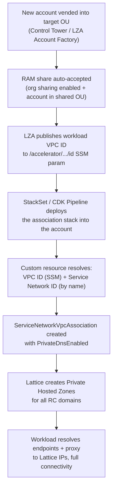

# Phase 4: Workload Onboarding

The first three phases built and exposed shared connectivity entirely inside the Network account: [Phase 1: Foundation](04-phase1-foundation.md) created the three Service Networks and their RAM shares, [Phase 2: Shared Endpoints](05-phase2-shared-endpoints.md) exposed the AWS service endpoints, and [Phase 3: Centralized Egress](06-phase3-centralized-egress.md) exposed the Squid proxy. None of that connectivity is reachable from a workload yet. This phase is where workloads come online, and it is deliberately the smallest phase in the guide. Onboarding a workload account is **a single VPC association**, deployed into **each workload account**, that ties the account's VPC to its environment's Service Network and switches on private DNS.

That one association is the whole onboarding action. With `PrivateDnsEnabled` set, VPC Lattice does the rest: it creates the Private Hosted Zones (PHZs) so the workload VPC automatically resolves `ssm.us-east-2.amazonaws.com`, the other AWS service domains, and the egress proxy domain to VPC Lattice IPs, with no per-workload DNS configuration, no endpoints to create, and no proxy to stand up. The bulk of this phase, then, is not the association itself but **how to deploy it across tens, hundreds, or thousands of accounts automatically** as new accounts are vended.

> **A note on conventions.** As elsewhere in this guide, examples use the `us-east-2` Region and placeholder identifiers (organization ID `o-EXAMPLE12345`, account `111111111111`). The reference IaC associates each workload VPC to a named Service Network: the CDK path uses names such as `sn-dev-shared`, and the CloudFormation path uses names such as `sn-dev-shared`. This section refers to "the dev service network" generically, but the **name you pass in must match the actual Service Network name created in Phase 1** for that environment, because the association resolves the network *by name*.

## Why Workload Onboarding comes last

This phase depends on Phase 1 directly and benefits from Phases 2 and 3. The dependency is concrete (this satisfies the deployment-order rationale in requirements 4.4 and 4.2):

- **It requires Phase 1.** The association attaches the workload VPC to a Service Network that must already exist *and* must already be RAM-shared to the workload account's OU. A custom resource in this stack looks the network up **by name**; if Phase 1 has not run, or the RAM share has not reached this account's OU, the lookup fails fast with a message telling you to accept the share. A workload account cannot associate to, or even discover, a network that has not been created and shared to its OU.
- **It benefits from Phases 2 and 3.** The association is what makes the shared endpoints and the egress proxy *usable* from the workload. Once associated with private DNS, the workload resolves the endpoint domains (Phase 2) and the `squid-proxy.egress.internal` proxy domain (Phase 3) to Lattice IPs. If you associate before Phases 2 and 3 have run, the association still succeeds, but there is nothing yet behind those domains to resolve. In practice you complete Phases 2 and 3 first so that the moment a workload onboards, the connectivity it resolves is already live.

Unlike the earlier phases, **this phase deploys to the workload account, not the Network account.** It is the only phase that runs outside the Network account, and it is the phase you run repeatedly, once per workload account (or, with the automation in [Step 4](#step-4--automate-onboarding-across-many-accounts), once per fleet, applied automatically to every account in scope).

## Account context

| Item | Value |
|------|-------|
| Deployment target | **Each workload account**, into the **workload VPC** |
| Region | `us-east-2` (adjust if you deploy elsewhere) |
| Depends on | [Phase 1: Foundation](04-phase1-foundation.md), the Service Network must exist and be RAM-shared to this account's OU |
| Benefits from | [Phase 2: Shared Endpoints](05-phase2-shared-endpoints.md) and [Phase 3: Centralized Egress](06-phase3-centralized-egress.md), the domains the workload resolves after association |
| Resources created | 1 lookup Lambda + role (custom resource), 1 `ServiceNetworkVpcAssociation` (with `PrivateDnsEnabled`) |
| Created automatically by Lattice | Private Hosted Zones for every associated Resource Configuration domain |
| Deployed how | Once per account, manually for a single account, or via **StackSets / CDK Pipelines** at fleet scale |

Everything in this phase deploys into a workload account. The management account's only involvement is having enabled organization-wide RAM sharing (a Phase 1 prerequisite) so the share auto-accepts here; you do not deploy anything to the management or Network accounts in this phase.

## Prerequisites

The global prerequisites in [Prerequisites](02-prerequisites.md) must be satisfied. The items below are the ones this phase depends on directly. Confirm them before you deploy into a workload account:

- [ ] **Phase 1 is complete**, and the Service Network for this account's environment exists in the Network account with a known **name** (for example `sn-dev-shared`). You pass this name into the stack; it is resolved to an ID at deploy time.
- [ ] **The RAM share has reached this account's OU.** Because `aws ram enable-sharing-with-aws-organization` was enabled in Phase 1, accounts in a targeted OU **auto-accept** the Service Network share, there is no manual invitation to accept (see [Step 4](#ram-share-auto-accept-with-aws-organizations)). The account must be in an OU that the environment's share targets.
- [ ] **The workload VPC exists and its ID is published to an SSM parameter** under the LZA `/accelerator/...` path (for example `/accelerator/network/vpc/Workload-Dev/id`). The stack resolves the VPC ID from this path rather than hardcoding it.
- [ ] **Deployment IAM capability in the workload account** to create an IAM role and Lambda function (the lookup custom resource), and a VPC Lattice `ServiceNetworkVpcAssociation`; and to read the `/accelerator/*` SSM parameters and call `vpc-lattice:ListServiceNetworks`. (CDK path additionally requires `cdk bootstrap` in the workload account and Region; StackSets requires the StackSet execution role.)
- [ ] **Phases 2 and 3 are deployed** in the Network account if you want the workload to resolve endpoints and the proxy immediately on association (recommended, but not required for the association itself to succeed).

## Step 1, Resolve the VPC ID and Service Network by name (Lambda custom resource)

The association needs two identifiers that are not known until deploy time and differ per account: the **workload VPC ID** and the **Service Network ID**. Hardcoding either would break the parameterization the pattern depends on (requirement 5.4), so both IaC variants resolve them at deploy time with a small **Lambda-backed custom resource**. Given two inputs, an SSM path and a Service Network *name*, it returns two outputs, the VPC ID and the Service Network ID.

The Lambda does two lookups:

1. **VPC ID from SSM.** It calls `ssm:GetParameter` on the supplied path (for example `/accelerator/network/vpc/Workload-Dev/id`) and returns the value as `VpcId`.
2. **Service Network ID by name.** It calls `vpc-lattice:ListServiceNetworks` (using a paginator, so it works regardless of how many networks are visible) and scans for the network whose `name` matches the supplied `ServiceNetworkName`. On a match it returns `ServiceNetworkId` (and `ServiceNetworkArn`). **If no match is found, it fails with a clear, actionable message**, on the CDK path it raises `ValueError("Service network '<name>' not found. Ensure the RAM share has been accepted in this account.")`. That message is the single most useful diagnostic in this phase: a "not found" almost always means the RAM share has not reached this account's OU, not that the name is wrong.

The lookup runs on a **Python 3 runtime** and handles the CloudFormation custom-resource lifecycle correctly, including a **`Delete` no-op** (returning success immediately so stack deletion is clean). The two IaC paths implement the same logic with the standard mechanism for each tool:

- **CDK** wraps the inline handler in a `cr.Provider` (the CDK custom-resource provider framework), which manages the CloudFormation response protocol for you.
- **CloudFormation** uses an inline handler that sends the response itself with `urllib3` via a small `send_cfn` helper (no external dependencies), following the standard custom-resource response pattern (requirement 5.6).

Both paths grant the Lambda a tightly scoped **LookupRole**: the AWS-managed `AWSLambdaBasicExecutionRole` for CloudWatch Logs, plus an inline policy allowing exactly two actions, `ssm:GetParameter` scoped to `arn:aws:ssm:<region>:<account>:parameter/accelerator/*`, and `vpc-lattice:ListServiceNetworks` on `*` (this action does not support resource-level permissions, so the wildcard is required). The CDK stack carries documented `cdk-nag` suppressions that record exactly these justifications, `AwsSolutions-IAM4` for the managed execution-role policy, and `AwsSolutions-IAM5` for the `/accelerator/*` path prefix and the unavoidable `ListServiceNetworks` wildcard, so the broad-looking grants are explained rather than silent.

## Step 2, Create the VPC association with PrivateDnsEnabled

With the VPC ID and Service Network ID resolved, the core resource is a single **`AWS::VpcLattice::ServiceNetworkVpcAssociation`**. It binds the workload VPC to the Service Network and is tagged with a `Name` of the form `lattice-vpc-assoc-<serviceNetworkName>`.

The property that makes onboarding "one action" is **`PrivateDnsEnabled: true`**. When set, VPC Lattice automatically creates the PHZs for every Resource Configuration custom domain on that network, so the workload VPC resolves those domains to Lattice IPs without any further DNS work (requirement 8.1). The CloudFormation template pairs it with **`DnsOptions: PrivateDnsPreference: ALL_DOMAINS`**:

```yaml
# cloudformation/vpc-lattice-workload-vpc-association.yaml
VpcAssociation:
  Type: AWS::VpcLattice::ServiceNetworkVpcAssociation
  Properties:
    ServiceNetworkIdentifier: !GetAtt ResourceLookup.ServiceNetworkId
    VpcIdentifier: !GetAtt ResourceLookup.VpcId
    PrivateDnsEnabled: true
    DnsOptions:
      PrivateDnsPreference: ALL_DOMAINS
    Tags:
      - Key: Name
        Value: !Sub 'lattice-vpc-assoc-${ServiceNetworkName}'
```

**`PrivateDnsPreference: ALL_DOMAINS`** instructs Lattice to manage private DNS resolution for *all* of the custom domains associated with the network, every endpoint RC plus the egress proxy RC, rather than a narrower subset. For this pattern that is exactly what you want: a workload should resolve the full set of shared endpoints and the proxy through Lattice the moment it associates, so `ALL_DOMAINS` is the correct preference.

### A real difference between the two IaC paths for PrivateDnsEnabled

Be careful here, because the CDK and CloudFormation paths are **not** equivalent on this exact property as the reference code is written:

- The **CloudFormation template sets `PrivateDnsEnabled: true` together with `DnsOptions: PrivateDnsPreference: ALL_DOMAINS` directly on the association.** It is the more complete reference for this behavior, deploy it and private DNS is on.
- The **CDK stack creates the same `CfnServiceNetworkVpcAssociation`** (`serviceNetworkIdentifier`, `vpcIdentifier`, and a `Name` tag), **but as written it does not set `PrivateDnsEnabled` in the L1 props.** An in-code comment is explicit about this: `PrivateDnsEnabled` is configured at the API level and must be applied either via the property *if your `aws-cdk-lib` version supports it*, or via a custom resource / CLI **after** deployment:

  ```bash
  aws vpc-lattice update-service-network-vpc-association \
    --service-network-vpc-association-identifier <association-id> \
    --private-dns-enabled
  ```

Do not assume the CDK stack turns on private DNS by itself. On the CDK path you must **explicitly ensure `PrivateDnsEnabled` is applied**, add it to the `CfnServiceNetworkVpcAssociation` props if your CDK version exposes it, or run the post-deploy CLI (or wrap it in a custom resource). If you skip this on the CDK path, the association will exist but the workload will **not** get the Lattice-managed PHZs, and AWS service domains will not resolve to Lattice IPs.

| Aspect | CloudFormation (`vpc-lattice-workload-vpc-association.yaml`) | CDK (`WorkloadAssociationStack`) |
|--------|--------------------------------------------------------------|----------------------------------|
| Association resource | `AWS::VpcLattice::ServiceNetworkVpcAssociation` | `cdk.aws_vpclattice.CfnServiceNetworkVpcAssociation` |
| `PrivateDnsEnabled` | **`true`, set directly on the resource** | **Not set in the L1 props as written**, apply via prop (if supported) or post-deploy CLI/custom resource |
| `DnsOptions` | `PrivateDnsPreference: ALL_DOMAINS` | Apply alongside `PrivateDnsEnabled` when you enable it |
| Name tag | `lattice-vpc-assoc-${ServiceNetworkName}` | `lattice-vpc-assoc-${serviceNetworkName}` |
| Treat as | Authoritative reference for `PrivateDnsEnabled` | Verify/enable `PrivateDnsEnabled` explicitly before relying on DNS |

## Step 3, DNS resolution behavior after association

Once the VPC association exists **with `PrivateDnsEnabled` in effect**, the workload VPC resolves the shared domains automatically, there is no per-workload DNS configuration to author (requirement 8.2). Concretely, a host in the associated dev VPC can immediately resolve:

- `ssm.us-east-2.amazonaws.com`, `sts.us-east-2.amazonaws.com`, the ECR domains, CloudWatch Logs, and the rest of the endpoints exposed in [Phase 2](05-phase2-shared-endpoints.md), each to a **VPC Lattice IP**, and
- the **`squid-proxy.egress.internal` proxy domain** exposed in [Phase 3](06-phase3-centralized-egress.md), which workloads point `HTTP_PROXY`/`HTTPS_PROXY` at on port 3128.

This works because, on association, Lattice creates a **Private Hosted Zone for each Resource Configuration's custom domain** and attaches it to the workload VPC. A DNS query for `ssm.us-east-2.amazonaws.com` is answered by that Lattice-managed PHZ with a Lattice IP; the workload connects to it; Lattice routes through the Resource Gateway ENI in the Network account to the RC's real target (the interface endpoint, or the internal NLB and Squid). This is the same managed resolution path described in the [Architecture](03-architecture.md#privatednsenabled-behavior-and-automatic-private-hosted-zone-creation) section (requirements 8.2 and 8.3); the only thing the workload account did to earn it was create the association.

> **Conflict case: an existing Route 53 PHZ for the same domain.** If the workload VPC is *already* associated with its own Route 53 Private Hosted Zone for one of these domains (for example a pre-existing `amazonaws.com` PHZ from a legacy per-account endpoint setup), that zone can take precedence over the Lattice-managed zone and the domain may resolve to the old target instead of the Lattice IP. This is the most common cause of "the association succeeded but DNS still resolves to the wrong place." The resolution precedence and the steps to remove or scope the conflicting zone are covered in [Troubleshooting and FAQ](12-troubleshooting-faq.md) (this is the forward reference for requirement 8.4).

## Step 4, Automate onboarding across many accounts

For a single account you deploy the stack once. At fleet scale, 50, 150, 500, or more accounts, you want onboarding to be **automatic**: when a new account is vended into the right OU, it should get connectivity without anyone touching it. The pattern supports at least two automation approaches (requirement 14.1), and both rely on the same RAM auto-accept behavior described below.

### Approach A, CloudFormation StackSets

Deploy `cloudformation/vpc-lattice-workload-vpc-association.yaml` as a **StackSet with service-managed permissions**, targeting the OUs that make up an environment. Service-managed StackSets integrate with AWS Organizations and support **automatic deployment to new accounts** added to the target OUs, so a freshly vended dev account automatically receives the association stack, with no manual step. Each account instance is parameterized with that environment's `VpcSsmPath` and `ServiceNetworkName`.

Because one environment maps to one Service Network name, you create **one StackSet (or one set of stack instances) per environment**, each targeting that environment's OUs and passing the matching `ServiceNetworkName` (for example `sn-dev-shared` for the dev OUs, `sn-stage-shared` for stage, `sn-prod-shared` for prod).

### Approach B, CDK Pipelines / cdk-stacksets

Deploy `WorkloadAssociationStack` across accounts from a **CDK Pipelines** pipeline (or with the `cdk-stacksets` library, which wraps StackSets in CDK constructs). The pipeline instantiates the stack per target account with the right props. As shown in `cdk/bin/app.ts`, a single instantiation looks like this:

```typescript
// cdk/bin/app.ts, one workload account (dev)
new WorkloadAssociationStack(app, 'WorkloadAssociationStack', {
  env,
  description: 'Associates a workload VPC with its VPC Lattice service network',
  vpcSsmPath: '/accelerator/network/vpc/Workload-Dev/id',
  serviceNetworkName: 'sn-dev-shared',
});
```

To onboard a fleet, the pipeline iterates target accounts and stamps out one stack per account, **mapping each account to the correct `serviceNetworkName` for its environment**, `sn-dev-shared` for dev accounts, `sn-stage-shared` for stage, `sn-prod-shared` for prod. The mapping of account → environment → Service Network name is the one piece of per-account configuration you must get right; everything else (VPC ID, network ID) is resolved at deploy time by the custom resource.

| Dimension | CloudFormation StackSets | CDK Pipelines / cdk-stacksets |
|-----------|--------------------------|-------------------------------|
| Template / stack | `vpc-lattice-workload-vpc-association.yaml` | `WorkloadAssociationStack` |
| Org integration | Service-managed permissions + Organizations | Via pipeline accounts or `cdk-stacksets` |
| Auto-onboard new accounts | **Yes**, automatic deployment to new accounts in target OUs | Via pipeline trigger or StackSet auto-deployment |
| Per-account inputs | `VpcSsmPath`, `ServiceNetworkName` parameters | `vpcSsmPath`, `serviceNetworkName` props |
| Environment mapping | One StackSet (or instance set) per environment's OUs | One stack per account, set `serviceNetworkName` per env |
| Best when | You standardize on CloudFormation and want native Organizations auto-deploy | You standardize on CDK and want type-safe, composable pipelines |

### RAM share auto-accept with AWS Organizations

Both approaches depend on the workload account already being able to *see* the Service Network, which is what RAM auto-accept provides (requirement 14.2). In Phase 1 you ran, once, from the management account:

```bash
aws ram enable-sharing-with-aws-organization
```

With organization-wide RAM sharing enabled, any account in an OU that a Service Network share targets **auto-accepts** that share, there is no manual RAM invitation to accept in each workload account. The practical effect for onboarding: the association can be created the moment the stack runs, because the network is already visible (and the lookup Lambda's `ListServiceNetworks` call returns it). The two prerequisites for auto-accept are therefore: **(1)** organization sharing is enabled (Phase 1), and **(2)** the account lives in an OU that the environment's share targets. If a deployment fails with "Service network '<name>' not found," check those two conditions first, it almost always means the account is outside the shared OU or the share has not propagated yet.

## End-to-end onboarding flow

Putting the pieces together, here is the full flow from a brand-new account to working connectivity, with no manual networking steps along the way (requirement 14.3):

1. **A new account is vended** into the correct OU, for example by AWS Control Tower / Landing Zone Accelerator (LZA) Account Factory placing it in a dev OU.
2. **The RAM share auto-accepts.** Because organization sharing is enabled and the account is in a targeted OU, the dev Service Network share is accepted automatically; the network becomes visible in the account.
3. **LZA publishes the VPC's SSM parameters.** The account's workload VPC ID (and related IDs) land under `/accelerator/network/vpc/.../id`.
4. **The StackSet or pipeline deploys the association stack** into the account, automatically, because the account joined a target OU (StackSet auto-deploy) or because the pipeline stamps it out.
5. **The custom resource resolves identifiers.** The lookup Lambda reads the VPC ID from SSM and finds the Service Network ID by name via `ListServiceNetworks`.
6. **The `ServiceNetworkVpcAssociation` is created with `PrivateDnsEnabled`** (set directly on the CloudFormation path; explicitly applied on the CDK path).
7. **Lattice creates the Private Hosted Zones** for every Resource Configuration domain on the network and attaches them to the workload VPC.
8. **The workload has full connectivity.** It resolves the AWS service endpoints (Phase 2) and the egress proxy (Phase 3) to Lattice IPs and can call AWS services privately and reach the internet through the filtered proxy, with no per-account endpoints, NAT Gateways, or DNS zones to manage.



## IaC reference

This phase corresponds to one CDK stack and one CloudFormation template, each deployable per workload account. (This addresses requirements 4.3 and 14.4.)

### CDK path

The stack is `WorkloadAssociationStack` in `cdk/lib/workload-association-stackset-stack.ts`. Its props are just the two per-account inputs:

```typescript
// props consumed by WorkloadAssociationStack
vpcSsmPath: string;          // SSM path to the workload VPC ID, e.g. /accelerator/network/vpc/Workload-Dev/id
serviceNetworkName: string;  // RAM-shared Service Network name, e.g. sn-dev-shared
```

The stack defines the scoped lookup role, the inline lookup Lambda, and a `cr.Provider` that fronts it:

```typescript
// cdk/lib/workload-association-stackset-stack.ts, lookup Lambda + provider
const lookupFn = new lambda.Function(this, 'LookupFunction', {
  runtime: lambda.Runtime.PYTHON_3_14, // current Python 3 runtime in the reference
  handler: 'index.handler',
  timeout: cdk.Duration.seconds(30),
  role: lookupRole,
  code: lambda.Code.fromInline(`...resolve VpcId from SSM; find Service Network by name;
    raise ValueError("Service network '...' not found. Ensure the RAM share has been
    accepted in this account.") if missing; Delete = no-op...`),
});

const provider = new cr.Provider(this, 'LookupProvider', { onEventHandler: lookupFn });

const lookup = new cdk.CustomResource(this, 'ResourceLookup', {
  serviceToken: provider.serviceToken,
  properties: { SsmPath: props.vpcSsmPath, ServiceNetworkName: props.serviceNetworkName },
});
```

It then creates the association from the resolved IDs. Note the comment block that documents the `PrivateDnsEnabled` handling described in [Step 2](#a-real-difference-between-the-two-iac-paths-for-privatednsenabled):

```typescript
// cdk/lib/workload-association-stackset-stack.ts, the association
const vpcAssociation = new cdk.aws_vpclattice.CfnServiceNetworkVpcAssociation(
  this, 'VpcAssociation', {
    serviceNetworkIdentifier: lookup.getAttString('ServiceNetworkId'),
    vpcIdentifier: lookup.getAttString('VpcId'),
    tags: [{ key: 'Name', value: `lattice-vpc-assoc-${props.serviceNetworkName}` }],
  }
);

// PrivateDnsEnabled is NOT set in the L1 props as written. Apply it via the prop
// (if your aws-cdk-lib version supports it) or post-deployment:
//   aws vpc-lattice update-service-network-vpc-association \
//     --service-network-vpc-association-identifier <id> --private-dns-enabled
```

The stack outputs `VpcAssociationId`, `ResolvedVpcId`, and `ResolvedServiceNetworkId`. Deploy a single dev account with:

```bash
cd cdk
npx cdk deploy WorkloadAssociationStack \
  -c region=us-east-2
# vpcSsmPath and serviceNetworkName are set in app.ts (e.g. '/accelerator/network/vpc/Workload-Dev/id'
# and 'sn-dev-shared'); for a fleet, instantiate one stack per account from a CDK Pipeline.

# CDK path: ensure PrivateDnsEnabled is applied (if not set via the L1 prop)
aws vpc-lattice update-service-network-vpc-association \
  --service-network-vpc-association-identifier <association-id> \
  --private-dns-enabled --region us-east-2
```

### CloudFormation path

`cloudformation/vpc-lattice-workload-vpc-association.yaml` is the StackSet-deployable template. Its parameters are `VpcSsmPath` and `ServiceNetworkName`; it defines the same `LookupRole` / `LookupFunction` (here on the `python3.12` runtime, using an inline `urllib3` `send_cfn` handler that returns `FAILED` if the network is not found), a `Custom::ResourceLookup`, and the `VpcAssociation` shown in [Step 2](#step-2--create-the-vpc-association-with-privatednsenabled), which sets `PrivateDnsEnabled: true` and `DnsOptions: PrivateDnsPreference: ALL_DOMAINS` directly. It outputs `VpcAssociationId`, `ResolvedVpcId`, and `ResolvedServiceNetworkId`.

Deploy to a **single** workload account:

```bash
aws cloudformation deploy \
  --region us-east-2 \
  --stack-name vpc-lattice-workload-assoc \
  --template-file cloudformation/vpc-lattice-workload-vpc-association.yaml \
  --capabilities CAPABILITY_IAM \
  --parameter-overrides \
    VpcSsmPath=/accelerator/network/vpc/Workload-Dev/id \
    ServiceNetworkName=sn-dev-shared
```

Deploy to **many** accounts with a service-managed StackSet that auto-deploys to new accounts in the dev OUs:

```bash
# 1. Create the StackSet (service-managed, auto-deploy to new accounts in target OUs)
aws cloudformation create-stack-set \
  --stack-set-name vpc-lattice-workload-assoc-dev \
  --template-body file://cloudformation/vpc-lattice-workload-vpc-association.yaml \
  --permission-model SERVICE_MANAGED \
  --auto-deployment Enabled=true,RetainStacksOnAccountRemoval=false \
  --capabilities CAPABILITY_IAM \
  --parameters \
    ParameterKey=VpcSsmPath,ParameterValue=/accelerator/network/vpc/Workload-Dev/id \
    ParameterKey=ServiceNetworkName,ParameterValue=sn-dev-shared \
  --region us-east-2

# 2. Roll out to the dev OUs (replace with your dev OU IDs)
aws cloudformation create-stack-instances \
  --stack-set-name vpc-lattice-workload-assoc-dev \
  --deployment-targets OrganizationalUnitIds=ou-EXAMPLE-dev1,ou-EXAMPLE-dev2 \
  --regions us-east-2 \
  --region us-east-2
```

Repeat the StackSet per environment, substituting the matching `ServiceNetworkName` (`sn-stage-shared` for stage, `sn-prod-shared` for prod) and that environment's OU IDs. New accounts later vended into those OUs are onboarded automatically by the StackSet's auto-deployment.

## Expected outcome

After this phase runs in a workload account, that account has:

- **One `ServiceNetworkVpcAssociation`** binding its workload VPC to the correct environment's Service Network, tagged `lattice-vpc-assoc-<serviceNetworkName>`, with **`PrivateDnsEnabled` in effect** (set directly on the CloudFormation path; explicitly applied on the CDK path).
- **Lattice-managed Private Hosted Zones** created automatically for every associated Resource Configuration domain, the Phase 2 endpoints and the Phase 3 `squid-proxy.egress.internal` proxy domain.
- **Automatic DNS resolution** of the AWS service domains and the proxy domain to **VPC Lattice IPs**, with no per-workload DNS configuration, no per-account endpoints, and no per-account NAT Gateway.

At fleet scale, the same outcome is produced automatically for every account in the targeted OUs, and for every new account vended into them, which is the operational payoff of the whole pattern: onboarding a workload account is a single association, applied automatically. (This satisfies the expected-outcome requirement 4.2.)

### Verification

From an instance, container, or Lambda **inside the associated workload VPC**, confirm DNS resolution and end-to-end connectivity:

```bash
# 1. AWS service domains resolve to an IP managed by VPC Lattice, an address
#    that is NOT part of the workload VPC CIDR and not a public service IP
dig +short ssm.us-east-2.amazonaws.com
dig +short sts.us-east-2.amazonaws.com

# 2. The association exists with private DNS enabled
aws vpc-lattice list-service-network-vpc-associations --region us-east-2
aws vpc-lattice get-service-network-vpc-association \
  --service-network-vpc-association-identifier <association-id> --region us-east-2 \
  --query "{state:status,privateDns:privateDnsEnabled}"

# 3. A real AWS API call succeeds through the Lattice-routed endpoint
aws sts get-caller-identity --region us-east-2

# 4. Internet egress works through the Phase 3 proxy (allowed domain succeeds)
export HTTP_PROXY=http://squid-proxy.egress.internal:3128
export HTTPS_PROXY=http://squid-proxy.egress.internal:3128
curl -sS -o /dev/null -w "%{http_code}\n" https://aws.amazon.com
```

The decisive check is the first one: `dig ssm.us-east-2.amazonaws.com` should return an **IP address managed by VPC Lattice**, for the resource-based pattern in this guide, an address in the public `129.224.0.0/17` range (not the workload VPC CIDR, and not the service's public anycast IP), confirming the Lattice-managed PHZ is answering. (See [What IP ranges does VPC Lattice resolve to](12-troubleshooting-faq.md#what-ip-ranges-does-vpc-lattice-resolve-to-and-what-about-ipv6) for why this is the resource range, not the `169.254.171.x` services range.) A normal private VPC address there means private DNS is not in effect; on the CDK path, that is the signal to apply `PrivateDnsEnabled` as described in [Step 2](#a-real-difference-between-the-two-iac-paths-for-privatednsenabled); if it persists, suspect a conflicting Route 53 PHZ and see [Troubleshooting and FAQ](12-troubleshooting-faq.md).

Also check, in the console:

- **VPC Lattice → Service networks → VPC associations**: the workload VPC listed, association **Active**, private DNS enabled.
- **Route 53 → Hosted zones**: the Lattice-managed Private Hosted Zones for the endpoint domains and the `squid-proxy.egress.internal` domain, associated with the workload VPC.
- **CloudFormation → the association stack → Outputs**: `VpcAssociationId`, `ResolvedVpcId`, and `ResolvedServiceNetworkId` populated with the expected values.

If the deployment failed at the custom resource with "Service network '<name>' not found," the network is not visible in this account, confirm the account is in an OU that the environment's RAM share targets and that organization sharing is enabled (see [Step 4](#ram-share-auto-accept-with-aws-organizations)).

With workloads onboarding through a single automated association, in-Region service access and egress are fully in place. The next phase opens the same shared fabric to consumers that live outside an associated VPC, external, on-premises, and cross-Region, through Service Network Endpoints.

Continue to [Phase 5: Ingress via Service Network Endpoints](08-phase5-ingress-service-network-endpoints.md).
