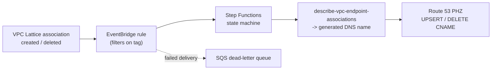
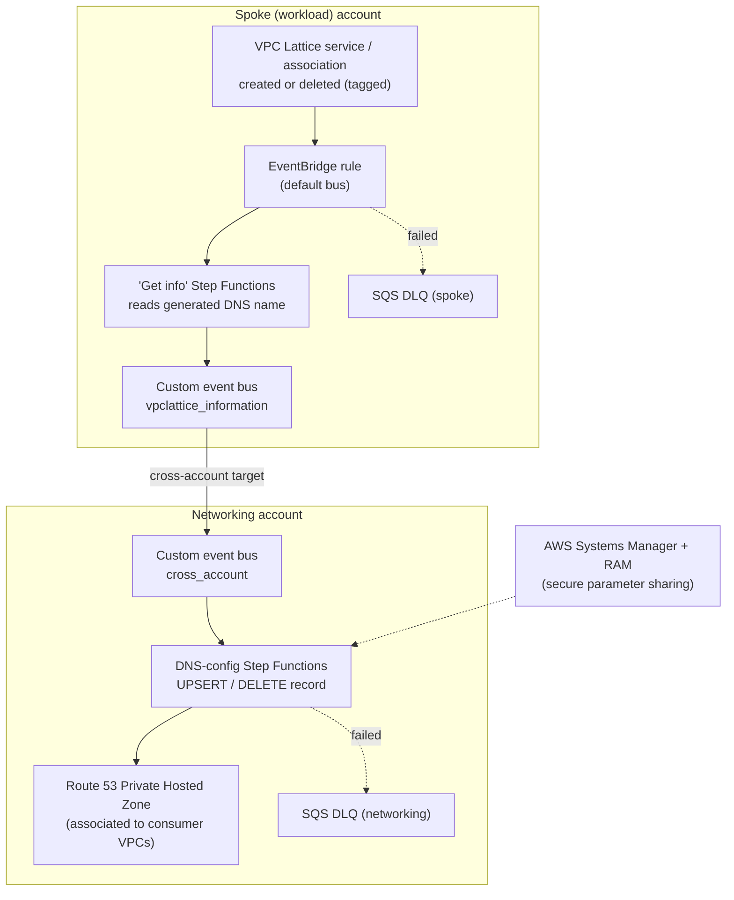

# Phase 5: Ingress via Service Network Endpoints

[Phase 4: Workload Onboarding](07-phase4-workload-onboarding.md) connected each workload VPC to its environment's Service Network with a single **Service Network VPC Association (SN-A)** and `PrivateDnsEnabled`, completing in-Region service access and egress. This phase opens the *same* shared fabric to consumers that live **outside** an associated VPC, external clients, on-premises systems reached over AWS Direct Connect or AWS Site-to-Site VPN, and consumers in **another AWS Region**. They reach the fabric through a **Service Network VPC Endpoint (SN-E)** rather than an association.

The four prior phases build the pattern on SN-A: one association per workload VPC, with `PrivateDnsEnabled` letting VPC Lattice create and own the Private Hosted Zones automatically. That is the right default for in-Region, multi-account workloads, and it requires no DNS authoring at all. This phase is the in-scope ingress complement: it stands up an SN-E and the DNS automation that an SN-E requires, so that the shared endpoints and the egress proxy from Phases 2 and 3 are reachable by consumers an association cannot serve.

> **How this phase is delivered.** Like Phases 1 through 4, this phase ships as deployable IaC at CDK and CloudFormation parity. The headline use case it builds and that this repository validates end to end is: an external, on-premises, or cross-Region consumer reaches a **private workload application** through the fabric, with no internet exposure on the path: `consumer -> Service Network VPC Endpoint (SN-E) -> service network -> workload Resource Gateway -> app`. The pieces are:
>
> - **SN-E** (`VpcLatticeIngressStack` / `cloudformation/vpc-lattice-ingress-sne.yaml`): the ingress door in the Network account's Ingress VPC, with a security group that admits approved consumer CIDRs on the workload app port(s) only.
> - **Ingress hosted zone** (`VpcLatticeIngressZoneStack` / `cloudformation/vpc-lattice-ingress-zone.yaml`): the `ingress.internal` Route 53 private hosted zone for friendly custom domains.
> - **DNS automation** (`VpcLatticeIngressDnsStack` / `cloudformation/vpc-lattice-ingress-dns-automation.yaml`): event-driven and Lambda-free (EventBridge to Step Functions to Route 53, DynamoDB-tracked). When a shared Resource Configuration is tagged **`PublishIngressDns=<custom domain>`**, it resolves that resource's SN-E generated DNS name and UPSERTs a CNAME for the custom domain; removing the tag deletes the record. For workload accounts, the same stack provisions an **org-scoped cross-account event bus**, and `WorkloadIngressDnsForwarderStack` / `cloudformation/workload-ingress-dns-forwarder.yaml` (deployed in the workload account) forwards that account's RC tag changes to it, so the friendly domain auto-publishes even though the RC lives in a different account.
> - **Producer** (`WorkloadAppStack` / `cloudformation/workload-app.yaml`): a workload account exposing a private app as a Resource Configuration on the shared service network, tagged for publishing.
>
> The CLI steps and blueprint below remain the conceptual walkthrough, modeled on the productized [Guidance for Amazon VPC Lattice Automated DNS Configuration on AWS](https://aws.amazon.com/solutions/guidance/amazon-vpc-lattice-automated-dns-configuration-on-aws/), and re-targeted from VPC Lattice Services to the VPC Resources model this guide uses. The conceptual walkthrough keys on the AWS solution's `lattice-dns-automation` tag; the **shipped stacks key on the `PublishIngressDns` Resource Configuration tag** described above. The shape of the flow is identical.

Reach for this phase whenever a consumer must do something a single association cannot express:

- **Reach more than one service network from a single VPC.** A VPC can hold only one SN-A but many SN-Es. A VPC that consumes both a shared-services network and, say, a partner network needs SN-E.
- **Be reachable from outside its own VPC**, peered VPCs, AWS Transit Gateway, AWS Cloud WAN, on-premises over AWS Direct Connect or AWS Site-to-Site VPN, or **another AWS Region**. Service networks are Regional; an SN-E is how a consumer in a different Region or on-premises reaches one.
- **Front an ingress proxy layer** that serves multiple service networks from one place (an SN-E removes the 1:1 ingress-VPC-to-service-network mapping that an association implies).

The ingress data flow this phase builds is shown in [Architecture, Figure 4](03-architecture.md#ingress-data-flow-externalon-premisescross-region-consumer-to-the-fabric).

> **Conventions.** As elsewhere in this guide, examples use `us-east-2` (and a second Region, `us-west-2`, for the cross-Region case), organization ID `o-EXAMPLE12345`, and account `111111111111`. Replace all placeholders with your own values.

## Why SN-E needs a DNS record when SN-A does not

This is the single most important concept in this section, so it is worth stating plainly.

With **SN-A**, `PrivateDnsEnabled=true` hands DNS ownership to VPC Lattice: it creates a managed Private Hosted Zone for every associated Resource Configuration's custom domain and answers queries for them inside the associated VPC. You author nothing.

With **SN-E**, there is no such automatic PHZ. Instead, the endpoint publishes a **generated, globally unique DNS name for each service or resource** associated to the service network behind it. Those names resolve to the endpoint's **secondary IP addresses** (each VPC resource gets its own secondary IP from the endpoint's `/28` IPv4 / `/80` IPv6 range per AZ; VPC Lattice services may share one). To let your consumers use a friendly custom domain instead of the generated name, **you create the DNS record yourself**, mapping your custom domain to the generated name.

The generated name is not known until the endpoint and its associations exist, so at any scale you **automate** this record creation and deletion. That automation is the bulk of this section.

### CNAME or Alias?

Both work; they differ in one practical way.

| | **CNAME** | **Alias (Route 53)** |
|---|---|---|
| Maps your custom name to | The endpoint's generated DNS name | The endpoint's generated DNS name + its hosted zone ID |
| Works at the zone **apex** (e.g. `example.com` with no host label) | **No** (DNS spec forbids CNAME at apex alongside other records) | **Yes** |
| Works for any non-apex name (e.g. `app.example.com`) | **Yes** | **Yes** |
| Extra resolution hop | One CNAME indirection | None (resolved server-side by Route 53) |
| Portability | Any DNS provider | Route 53 only |

**This section uses a CNAME as the primary example** because it is provider-portable and is the pattern shown in the AWS [External Connectivity to Amazon VPC Lattice](https://aws.amazon.com/blogs/networking-and-content-delivery/external-connectivity-to-amazon-vpc-lattice/) post. If you need the custom name at a **zone apex**, use an **Alias** record instead, the field you write changes from a CNAME value to an `AliasTarget` (DNS name + hosted zone ID), but the automation shape is identical. The official [Guidance for Amazon VPC Lattice Automated DNS Configuration on AWS](https://aws.amazon.com/solutions/guidance/amazon-vpc-lattice-automated-dns-configuration-on-aws/) creates Alias records by default; this section's CNAME variant is the equivalent for non-apex custom names.

## Retrieving the generated DNS name

Whether you automate or do it by hand, the value you need comes from the endpoint's associations. From the console, open the service network VPC endpoint and read the **Associations** tab. From the CLI:

```bash
# List the associations on the SN-E; each association carries the generated DNS name
aws ec2 describe-vpc-endpoint-associations \
  --vpc-endpoint-ids vpce-EXAMPLE0000000000 \
  --region us-east-2 \
  --query "VpcEndpointAssociations[].{resource:ServiceNetworkResourceAssociationId,name:DnsEntry.DnsName,hostedZone:DnsEntry.HostedZoneId}" \
  --output table
```

`DnsEntry.DnsName` is the generated name you point a CNAME at. `DnsEntry.HostedZoneId` is the additional value you need if you create an **Alias** record instead.

## Step 1, Create the Service Network VPC Endpoint

Unlike an association, an SN-E is a VPC endpoint of type `ServiceNetwork`. It needs a security group (control inbound access to it the same way you would any interface endpoint) and one or more subnets.

```bash
# The RAM-shared service network ARN (shared to this account's OU in Phase 1)
SN_ARN=$(aws vpc-lattice list-service-networks \
  --region us-east-2 \
  --query "items[?name=='sn-dev-shared'].arn" --output text)

aws ec2 create-vpc-endpoint \
  --vpc-id vpc-EXAMPLE0000000000 \
  --vpc-endpoint-type ServiceNetwork \
  --service-network-arn "$SN_ARN" \
  --subnet-ids subnet-EXAMPLEa subnet-EXAMPLEb subnet-EXAMPLEc \
  --security-group-ids sg-EXAMPLE0000000000 \
  --ip-address-type ipv4 \
  --region us-east-2 \
  --tag-specifications 'ResourceType=vpc-endpoint,Tags=[{Key=Name,Value=sne-dev-shared},{Key=lattice-dns-automation,Value=enabled}]'
```

The `lattice-dns-automation=enabled` tag is what the automation below keys on, only tagged endpoints are processed, so you opt a VPC in to managed DNS explicitly.

Once the endpoint reports `Available`, its associations carry the generated DNS names you will map.

## Step 2, Automate the DNS record (single account first)

At the smallest scale you could create the CNAME by hand after reading `DnsEntry.DnsName`. But the generated name changes if an endpoint or association is recreated, and doing this by hand across a fleet does not scale, so automate it. Start with the **single-account** shape: everything (the endpoint, the automation, and the Private Hosted Zone) lives in one account. The [next section](#step-3--extend-to-cross-account-cross-region) extends it across accounts.

The flow has three moving parts:

1. **An Amazon EventBridge rule** that fires when a VPC Lattice service or a service-network resource association is created or deleted (filtered to your `lattice-dns-automation` tag).
2. **An AWS Step Functions state machine** that, on a create event, reads the generated DNS name (and hosted zone ID, if you use Alias) from the endpoint association, then upserts the record in the target Private Hosted Zone; on a delete event, removes it.
3. **A Route 53 Private Hosted Zone** for your custom domain, associated to the consumer VPC(s).



### The state machine logic

The state machine is deliberately small. In pseudocode, the create branch is:

```text
on event (resource association CREATED, endpoint tagged lattice-dns-automation=enabled):
  assoc      = describe-vpc-endpoint-associations(endpoint-id)         # generated name lives here
  dnsName    = assoc.DnsEntry.DnsName                                  # e.g. <generated>.vpc-lattice-svcs.us-east-2.on.aws
  customName = tag:custom-domain  (e.g. app.example.com)
  route53 ChangeResourceRecordSets:
    Action  = UPSERT
    Name    = customName
    Type    = CNAME
    TTL     = 60
    Value   = dnsName

on event (resource association DELETED):
  route53 ChangeResourceRecordSets:
    Action  = DELETE
    Name    = customName
    Type    = CNAME
    Value   = <previously recorded dnsName>
```

For the **Alias** variant, the only change is the Route 53 call: instead of a `CNAME` with a `ResourceRecords` value, you write an `A` (or `AAAA`) record with an `AliasTarget` of `{ DNSName: dnsName, HostedZoneId: assoc.DnsEntry.HostedZoneId, EvaluateTargetHealth: false }`. Everything else, the trigger, the lookup, the create/delete branching, is identical.

### Why a state machine and not a single Lambda

A plain Lambda works for the single-account case, and if that is all you need, use one. Step Functions earns its place as you grow:

- **Built-in retry and backoff** on the `describe` and `ChangeResourceRecordSets` calls, which can be throttled at fleet scale, without hand-rolling retry code.
- **A visible execution history** per event, when a record does not appear, you can see exactly which state failed and why, which is far easier to operate than parsing Lambda logs.
- **A clean place to branch** create vs delete vs update, and to fan out if one endpoint exposes many associations.
- **A natural cross-account seam** (below): the state machine in the networking account is invoked by events forwarded from spoke accounts, with a dead-letter queue at each hop.

## Step 3, Extend to cross-account, cross-Region

In a real multi-account organization the consumer VPCs and their Private Hosted Zones live in a central **networking account**, while the SN-Es are created in **spoke (workload) accounts**. The automation spans the two with a cross-account EventBridge bus. This is the shape of the official [Guidance for Amazon VPC Lattice Automated DNS Configuration on AWS](https://aws.amazon.com/solutions/guidance/amazon-vpc-lattice-automated-dns-configuration-on-aws/), and it is the production form of the single-account flow above.



Step by step:

1. **Spoke account, detect.** An EventBridge rule on the default bus matches VPC Lattice create/delete events carrying the `lattice-dns-automation` tag. (The same rule also catches the *removal* of the tag, which you treat as a delete.)
2. **Spoke account, enrich.** A "get information" state machine reads the generated domain name, the Lattice-managed hosted zone ID, and the custom domain from the association, then publishes a normalized event to a custom event bus (`vpclattice_information`).
3. **Cross-account hop.** That custom bus has the networking account's `cross_account` bus as a target. Failed deliveries land in a spoke-side SQS dead-letter queue for monitoring.
4. **Networking account, act.** The `cross_account` bus invokes the DNS-configuration state machine, which creates or deletes the corresponding record (CNAME, or Alias for apex names) in the Private Hosted Zone that is associated to the consumer VPCs. A networking-side DLQ captures failures.
5. **Parameter sharing.** AWS Systems Manager Parameter Store and AWS RAM carry the small amount of shared configuration (zone IDs, account mappings) securely between the accounts.

For **cross-Region** consumers, the only addition is that the Private Hosted Zone in the networking account is associated to the consumer VPC(s) in the other Region (a PHZ can be associated to VPCs in multiple Regions), and the consumer reaches the SN-E over your existing inter-Region connectivity (VPC peering, Transit Gateway inter-Region peering, or Cloud WAN). For **on-premises** consumers, follow the Route 53 Resolver inbound-endpoint pattern so that on-premises resolvers forward the custom domain to Route 53, which answers with the SN-E record.

## Security considerations specific to SN-E

- **Endpoint security group.** An SN-E is an interface endpoint; its security group controls who in the VPC can use it. Apply the same least-privilege approach the rest of this guide uses, restrict inbound to the specific client security groups or CIDRs that should consume the service network, not `0.0.0.0/0`.
- **The SN-A auth policy still applies.** Reaching a service network through an endpoint does not bypass the Service Network IAM auth policy. The `aws:PrincipalOrgID` / `aws:PrincipalOrgPaths` conditions from [Phase 1](04-phase1-foundation.md) are still evaluated, so cross-environment isolation holds for SN-E consumers exactly as it does for SN-A consumers.
- **Cross-account automation permissions.** Scope the networking-account state machine's role to `route53:ChangeResourceRecordSets` on the **specific hosted zone(s)** it manages, and the spoke-account roles to read-only `ec2:DescribeVpcEndpointAssociations` / `vpc-lattice:ListServiceNetworkResourceAssociations`. Avoid wildcard Route 53 permissions, a bug in event handling should never be able to rewrite an unrelated zone.
- **External (non-AWS) consumers.** If consumers sit outside AWS, an SN-E alone does not make a service publicly reachable (IPv6 SN-Es set `denyAllIgwTraffic`). Front them with the ingress proxy pattern from [External Connectivity to Amazon VPC Lattice](https://aws.amazon.com/blogs/networking-and-content-delivery/external-connectivity-to-amazon-vpc-lattice/), and apply SigV4 signing (with IAM Roles Anywhere for credentials outside AWS) if the service or network has an auth policy.

## When to choose SN-E over the default SN-A

Use this as the decision rule:

- **Default to SN-A** (Phases 2-4) for any in-Region workload VPC that consumes the shared services and egress this guide provides. It is simpler, needs no DNS authoring, and enforces a clean one-VPC-to-one-environment mapping.
- **Choose SN-E** (this phase) when at least one of these is true: the VPC must reach **more than one** service network; consumers are **cross-Region** or **on-premises**; or you are building a **shared ingress proxy** layer that should serve multiple service networks from one VPC.

Many organizations run both: SN-A for the bulk of workload accounts, and a small number of SN-Es for hybrid ingress and cross-Region consumers, with the DNS automation above keeping the SN-E records current.

## References

- [Managing DNS resolution with Amazon VPC Lattice and VPC resources](https://aws.amazon.com/blogs/networking-and-content-delivery/managing-dns-resolution-with-amazon-vpc-lattice-and-vpc-resources/), the canonical post on SN-A vs SN-E DNS behavior and IP ranges.
- [Guidance for Amazon VPC Lattice Automated DNS Configuration on AWS](https://aws.amazon.com/solutions/guidance/amazon-vpc-lattice-automated-dns-configuration-on-aws/), the productized cross-account EventBridge + Step Functions + Route 53 automation (Alias records).
- [External Connectivity to Amazon VPC Lattice](https://aws.amazon.com/blogs/networking-and-content-delivery/external-connectivity-to-amazon-vpc-lattice/), ingress proxy patterns and the CNAME chaining approach for external and cross-Region consumers.

Return to [Architecture](03-architecture.md#two-ways-a-vpc-reaches-a-service-network-sn-a-vs-endpoint-sn-e), or continue to [Best Practices](09-best-practices.md).
